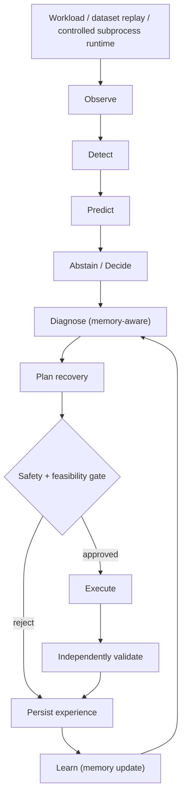

# Autonomous AI Infrastructure

Self-healing AI/ML infrastructure that observes workloads, estimates
whether it should trust its own read of the situation, predicts and
diagnoses failures, plans and safety-gates a recovery action, and learns
from persistent failure memory — evaluated with the same rigor a systems
paper would demand, including every negative and underpowered result.

## Origin

This project did not start from a blank page. It began by **auditing**,
not trusting, two independently developed predecessor prototypes:

- **AI-Abstention-Engine** (~9,700 backend lines) — confidence/abstention
  logic. Phase 1's audit (`docs/archive/PHASE1_AUDIT_REPORT.md`) found
  concrete defects: a live confidence-scale bug producing
  `global_reliability_score: 189.61` on a documented 0–100 scale (from
  averaging two incompatible representations), a query defaulting to
  abstention while its own explanation text claimed "Confidence 61%", a
  404 on `/api/metrics`, and a committed database containing real personal
  emails and password hashes.
- **Introspective Failure Memory Model** (~1,560 backend lines) — episodic
  failure memory and risk-coverage prediction. The audit found a real
  risk-coverage signal (baseline error 35.44% → 8.05% at 15% coverage) but
  no tests, in-memory-only storage, and a live 500 error from unhandled
  numpy JSON serialization.

Both were audited component-by-component before Phase 2 migrated them into
one pydantic-enforced architecture — **not a copy-paste merge**. That
migration immediately produced a real negative research finding: the
failure-memory risk signal did **not** improve calibrated abstention
beyond confidence alone (selective risk 0.1667 vs. 0.2083 at 20% coverage;
failure-memory correlation with correctness 0.031 — essentially noise —
vs. 0.200 for confidence). That negative result is what opened the current
research track (Phase 3 onward). Full detail:
[`docs/MASTER_RECORD_CONTENT.md`](docs/MASTER_RECORD_CONTENT.md), sections 3–7.

## Research question

Given calibrated confidence, persistent failure memory, and a controlled
recovery-selection environment, can a context-aware, learned recovery
policy detect and diagnose failures, abstain when evidence is
insufficient, and select a recovery action that measurably beats a
strong, non-learned heuristic — without exceeding a zero-tolerance
unsafe-action rate? This is scoped to what was actually run: a
pre-registered, frozen-protocol experimental track on real operational
data, a controlled recovery-selection environment, and a real AI/ML agent
evaluation track — not a claim of production deployment.

## Key capabilities — status, not a checklist

| Capability | Status | Evidence |
|---|---|---|
| Confidence-calibrated abstention (arithmetic self-consistency) | **DEMONSTRATED** | AUROC 0.955 (Phase 5.2 benchmark, n=310, underpowered vs. n=500 gate); 0.953 at Phase 4.6 scale |
| Confidence-calibrated abstention (extractive QA span-logit) | **DEMONSTRATED** | AUROC 0.938 (benchmark, n=49, underpowered); 0.934 at Phase 4.6 scale |
| Confidence-calibrated abstention (sentiment softmax-margin) | **NOT VALIDATED (discrimination)** / **PARTIALLY DEMONSTRATED (calibration)** | AUROC 0.439 — near-chance, a genuine discrimination ceiling; temperature scaling fixed ECE 0.089 → 0.023 without improving discrimination |
| Persistent failure memory changes recovery decisions | **DEMONSTRATED (controlled)** | Repeated-incident experiment: memory ON retry→retry→reconfigure→recovered vs. memory OFF retry×6, real process restarts |
| Failure-class diagnosis | **PARTIALLY DEMONSTRATED** | 35/35 (1.0) class-matching accuracy, but false-causal-attribution-rate is *also* 1.0 — no independent causal ground truth exists |
| Recovery execution (real, against project's own controlled runtime) | **PARTIALLY DEMONSTRATED** | Executes for real (not simulated table lookup); benchmark-slice recovery success is 0/35 — a genuine negative finding, not a defect |
| Safety gating | **DEMONSTRATED** | 6-case and 16-case adversarial safety matrices, 0 incorrectly authorized, across two independent phases |
| Failure prediction — `resource_unavailable` | **DEMONSTRATED (aggregate only)** | STRONG_EVIDENCE from a real pre-flight-probe mechanism; `NOT_EVALUABLE` at benchmark record level (no per-episode join key) |
| Failure prediction — `cpu` / pooled `oom` / `flaky` | **NOT VALIDATED** | Always-fires false-alarm-rate ≈ 1.0 despite a nominal AUROC edge, confirmed across replicates |
| Environment generalization — ranking | **DEMONSTRATED (aggregate only)** | OOM AUROC transfers well: dev 0.989, held-out 0.983, robustness 0.935 |
| Environment generalization — operating point | **NOT VALIDATED** | The fixed decision threshold does not transfer cleanly — ranking generalization ≠ operating-point generalization |
| Memory adaptation at benchmark scale | **NOT EVALUABLE** | Only 1 repeated-workload group (3 records) exists in the canonical dataset |
| Multi-environment generalization at benchmark scale | **NOT EVALUABLE** | Canonical dataset represents only 1 environment |
| Production self-healing / deployment | **NOT VALIDATED / OUT OF SCOPE** | Recovery runs against this project's own local controlled subprocess runtime, not a production fleet |

## Architecture



Full diagram set (8 diagrams, implemented-vs-simulated/aggregate-only
clearly distinguished): [`docs/architecture/`](docs/architecture/README.md).

## Autonomy control loop

`src/phase4/pipeline.py`'s `AutonomyPipeline` implements this loop end to
end: `observe → detect → predict → decide/abstain → diagnose (memory-aware)
→ plan (memory-informed) → safety-gate → execute → independently validate →
learn`, walking an explicit `AutonomyState` enum (`RECEIVED → OBSERVING →
PREDICTED → DECIDING → DIAGNOSING → PLANNING → SAFETY_CHECK → EXECUTING →
VALIDATING → RECOVERED / NOT_RECOVERED / ABSTAINED → COMPLETED`). Two entry
points exercise it: `run_workload()` (process/infrastructure telemetry —
CPU timeout, OOM, GPU absence, data corruption, resource contention, flaky
processes, network failure) and `run_agent_task()` (a real AI/ML agent's
output — arithmetic self-consistency, sentiment classification, extractive
QA — each with its own correctness oracle and uncertainty mechanism).
Recovery executes for real against this project's own controlled
subprocess runtime (`ControlledRuntime.run()`), not a simulated
ground-truth lookup table, and validation independently re-derives the
outcome from raw events through a fresh `MonitoringEngine` rather than
trusting the executor's self-report (tested against a deliberately lying
executor).

## Quantitative results (real numbers, pulled from source artifacts)

### Uncertainty (Phase 5.2 benchmark, calibration/test split; Phase 4.6 in-project scale in parentheses)

| Family | Metric | Value | n (test) | Status |
|---|---|---|---|---|
| Arithmetic self-consistency | AUROC | 0.955 (0.953 at Phase 4.6 scale) | 310 (min 500) | UNDERPOWERED |
| Extractive QA span-logit | AUROC | 0.938 (0.934 at Phase 4.6 scale) | 49 (min 300) | UNDERPOWERED |
| Sentiment softmax-margin | AUROC | 0.439 (0.659 at Phase 4.6 scale) | 113 (min 300) | UNDERPOWERED, near-chance |
| Sentiment (4 candidate estimators) | AUROC | mathematically identical across all 4 | — | Rank-equivalent transforms — real, explained negative result |

### Temperature scaling (calibration, not discrimination)

| Family | ECE before | ECE after | AUROC change |
|---|---|---|---|
| Sentiment | 0.089 | 0.023 | none — discrimination ceiling unchanged |

### Abstention (benchmark, `SIMULATED_POLICY_EVALUATION` — no realized ABSTAIN/RETRY episodes exist in the raw sources)

| Task | Selective risk | n | Status |
|---|---|---|---|
| ABST-ARITH | 0.0 | 310 | PARTIALLY_VALIDATED |
| ABST-SENT | 0.3125 | 113 | PARTIALLY_VALIDATED |
| ABST-QA | 0.03125 | 49 | PARTIALLY_VALIDATED |

### Calibrated-vs-generic decision policy

The generic `DecisionPolicy` (`answer_threshold=0.70`, `abstain_threshold=0.40`)
and the agent-specific calibrated profile (`AgentDecisionCalibrationProfile`,
Phase 4.7 — 4 fixed agreement-rate buckets, Laplace-smoothed per-bucket
estimates, pre-registered expected-utility formula) were both stress-tested:
an 18-point pre-registered grid over `COST_RETRY_PER_EXTRA_SAMPLE` ×
`BENEFIT_CORRECT` × `COST_WRONG_ANSWER` produced byte-identical
decisions/outcomes in all 18 configurations (final accuracy 1.000 on a
40-seed/3-wrong-episode grid) — no fragility observed within the
pre-registered range, with the explicit caveat that this small grid limits
how far "no fragility" generalizes.

### Memory — repeated-incident result

| Condition | Sequence (real process restarts) |
|---|---|
| Memory ON | retry → retry → reconfigure → **recovered** |
| Memory OFF | retry × 6 (no adaptation) |

Separately, a 300-episode full-loop evaluation (Phase 4.10) found no
observable ON/OFF difference for a documented structural reason: every
episode used a distinct `workload_id`, so no episode's stored experience
was ever eligible for retrieval by a later one — the memory-isolation
contract behaving exactly as designed, not evidence memory is inert.

### Failure prediction (P3/P4/P5 evidentiary stages, aggregate-level; all 4 `PRED-*` benchmark tasks are `NOT_EVALUABLE` at record level)

| Failure class | Real AUROC vs. shuffled control | False-alarm-rate at calibrated threshold | Status |
|---|---|---|---|
| `resource_unavailable` | pre-flight-probe feature; combined feature reached AUROC 0.916 (held-out) | — | **STRONG_EVIDENCE** |
| `oom` (≥2-observability-sample subset) | 0.780 ± 0.096 vs. 0.625 ± 0.093 (shuffled) — real, replicated ranking edge | 1.00 ± 0.00, specificity 0.179 ± 0.254 | **NOT VALIDATED** at operating point despite real ranking signal |
| `cpu` | 0.616 ± 0.045 vs. 0.389 ± 0.032 (shuffled) | 1.00 ± 0.00 | **NOT VALIDATED, final** |
| `flaky`, pooled `oom` | nominal edge present | always-fires (≈1.00) | **NOT VALIDATED** |

### Environment generalization (Phase 4.9, aggregate-level; `GEN-*` benchmark tasks `NOT_EVALUABLE` at record level)

| Metric | Dev | Held-out | Robustness |
|---|---|---|---|
| OOM AUROC (ranking) | 0.989 | 0.983 | 0.935 |

**Ranking generalizes; the fixed operating-point threshold does not
transfer cleanly across environments** — reported as two distinct claims,
never merged into one "generalizes" statement.

### Recovery

| Result | Value | Scope |
|---|---|---|
| Recovery success (benchmark `REC-EVAL`) | 0/35 (0.0) | Phase 5.2 dataset slice — genuine negative finding |
| Safety-adversarial matrix | 0/6 and 0/16 incorrectly authorized (two independent phases) | Phase 4.4/5 and Phase 4.5 gap fixes |
| `RECONFIGURE` vs. `RETRY` on `RESOURCE_UNAVAILABLE` | 100% recovery (Wilson 95% CI [0.91,1.0]) vs. 0% (CI [0.0,0.09]) | n=40 each, real controlled-runtime executions |

### Diagnosis

| Metric | Value | Caveat |
|---|---|---|
| Failure-class-matching accuracy | 1.0 (35/35) | **Never state this without the next line** |
| False-causal-attribution-rate | 1.0 | No independent causal ground truth exists in this dataset — every diagnosis names a cause, none is independently verified |

### Final benchmark capability matrix

16 tasks / 8 tracks / 33 metrics / 10 baselines / 5 ablations, scored
against the Phase 5.2 canonical dataset:

**0 VALIDATED · 6 PARTIALLY_VALIDATED · 3 UNDERPOWERED · 0 NOT_VALIDATED · 7 NOT_EVALUABLE**

Full per-task table: [`BENCHMARK_CARD.md`](experiments/results/phase5_6_external_release/20260827T055356Z/BENCHMARK_CARD.md).
**Read it left to right — there is no single overall benchmark score.**

## Honest negative and limited findings

This section is as visible as the results above, deliberately, per this
project's own integrity discipline:

1. **Sentiment uncertainty has a real discrimination ceiling** (AUROC
   0.439–0.659 depending on scale) that calibration cannot fix — 4
   candidate estimators tested produced mathematically identical AUROC
   (rank-equivalent transforms), a real negative result, not a bug.
2. **3 of 4 failure-prediction classes are `NOT VALIDATED`** — `cpu`,
   pooled `oom`, and `flaky` all show an always-fires false-alarm-rate near
   1.0 at their calibrated threshold despite a nominally positive AUROC
   edge that does not survive replication in most cases.
3. **All 4 `PRED-*` benchmark tasks are `NOT_EVALUABLE` at record level** —
   their only supporting evidence is Phase 4 aggregate-level results, with
   no per-episode join key in the canonical dataset.
4. **Diagnosis accuracy (1.0) always carries a false-causal-attribution-rate
   of 1.0 in the same breath** — no independent causal ground truth exists;
   this is class-matching, not causal diagnosis.
5. **Recovery success is 0/35 on the benchmark dataset slice** — a genuine
   negative finding, reported as such, not softened.
6. **Ranking generalization ≠ operating-point generalization** — OOM
   ranking transfers well (0.989/0.983/0.935) but the fixed decision
   threshold does not; these are always reported as two distinct claims.
7. **Memory adaptation and multi-environment generalization are
   `NOT_EVALUABLE` at benchmark scale** — 1 repeated-workload group (3
   records) and 1 represented environment respectively, far below any
   usable evaluation scale, even though the underlying Phase 4 mechanisms
   are real and separately demonstrated in aggregate.
8. **Phase 4.2 pattern learning is underpowered, not negative** — 21 of a
   pre-registered 50 required evaluable contexts.
9. **Two consecutive "hypothesis not supported" verdicts** on controlled
   recovery-policy learning (Phase 4.3, 4.4); a later exploratory,
   post-hoc, explicitly-not-pre-registered analysis found neither phase
   had checked feasibility headroom before freezing its threshold — this
   does not reopen either recorded verdict.
10. **No model repository was published to Hugging Face** — no single
    trained-model artifact in this project is independently validated at
    record level; see [Hugging Face](#hugging-face) below.

## Benchmark

16 tasks across 8 tracks (uncertainty, abstention, failure_prediction,
diagnosis, recovery, memory, generalization, end_to_end), 33 metrics
(AUROC/AUPRC/Brier/ECE/risk-coverage with bootstrap CIs, Wilson CIs for
binomial rates), 10 baselines (including adversarial ones like
`BASE-ALWAYS-ABSTAIN`, flagged `ALWAYS_ABSTAIN_NOT_SUCCESSFUL`, so a
trivial policy cannot appear to win), 5 ablations (2 computable, 3
`AGGREGATE_REFERENCE_EVIDENCE` only), 12 leakage rules (3 mechanically
enforced every run). Determinism verified: the runner executes the full
benchmark twice per invocation and reports `determinism_check`;
independently re-verified byte-identical across separate process
invocations on different days. Full card:
[`BENCHMARK_CARD.md`](experiments/results/phase5_6_external_release/20260827T055356Z/BENCHMARK_CARD.md).
Diagram: [`docs/architecture/07_benchmark_architecture.md`](docs/architecture/07_benchmark_architecture.md).

## Dataset

3,106 records: 3,060 `agent_task` episodes (2,000 arithmetic
self-consistency, 660 sentiment, 400 extractive QA) and 46
`controlled_runtime` failure/recovery episodes — generated entirely by
this project's own Phase 4 evaluation code, no third-party dataset
content. 1 represented environment. Splits (grouped by `workload_id`, 0
crossings): train=2,142, calibration_validation=482, test=482. Several
Phase 4 findings (e.g. `resource_unavailable` prediction, OOM environment
generalization) are real but only exist as **aggregate-level** evidence
from the original evaluation runs — the canonical dataset has no
per-episode join key that would let a benchmark re-derive them at record
level, so those tasks are honestly marked `NOT_EVALUABLE` rather than
scored from data that cannot support the score. Full card:
[`DATASET_CARD.md`](experiments/results/phase5_6_external_release/20260827T055356Z/DATASET_CARD.md).

## Hugging Face

- Dataset: <https://huggingface.co/datasets/naishashetty/autonomous-ai-infrastructure-dataset> (CC BY 4.0)
- Benchmark: <https://huggingface.co/datasets/naishashetty/autonomous-ai-infrastructure-benchmark> (MIT)
- No model repository was published — see the [Honest negative and limited
  findings](#honest-negative-and-limited-findings) section, item 10, and
  `RELEASE_DECISION.md` in the Phase 5.6 release directory for the full
  reasoning.

## Tech stack

Actually used, per `requirements.txt`: Python, Pydantic (canonical event
schema), SQLAlchemy + SQLite (persistence), scikit-learn / numpy / pandas /
scipy (calibration, statistics), PyTorch + Hugging Face Transformers (real
agent-task models: sentiment/QA checkpoints), matplotlib (reporting),
FastAPI + Uvicorn (demo API), pytest (unit/integration/e2e/recovery test
suite). The standalone benchmark release package has a much smaller,
pinned dependency set — numpy, pandas, scikit-learn, scipy only (see
`experiments/results/phase5_6_external_release/20260827T055356Z/release/benchmark/requirements.txt`)
— no torch/transformers required to run the benchmark itself.

## Quick start

```bash
git clone https://github.com/NaishaShetty/Autonomous-AI-Infrastructure-.git
cd Autonomous-AI-Infrastructure-
python -m venv .venv
source .venv/bin/activate      # Windows: .venv\Scripts\activate
pip install -r requirements.txt

python -m pytest tests/ -q                              # full test suite (see Testing below)
python scripts/run_phase5_4_benchmark.py                # run the 16-task benchmark, writes to experiments/results/
python scripts/run_phase4_5_pipeline_demo.py            # closed-loop autonomy pipeline evidence run
python scripts/demo_autonomy_loop.py                    # Phase 6 demo: one real pipeline episode, plain output
uvicorn src.api.app:app --port 8000                     # POST /api/analyze -> canonical runtime controller
```

## CLI / API demo

`python scripts/run_phase5_4_benchmark.py` runs the full 16-task benchmark
against the canonical dataset, runs it twice to verify determinism, and
writes the capability matrix and all supporting artifacts to
`experiments/results/phase5_benchmark_implementation/<timestamp>/`.
`scripts/demo_autonomy_loop.py`
(new in Phase 6) drives one real episode through
`AutonomyPipeline.run_workload()` end to end — observe → detect → predict
→ decide → diagnose → plan → safety-gate → recover → validate → learn —
and prints each stage's real output. It is not cherry-picked to always
succeed: whichever outcome the deterministic scenario actually produces
(recovered, not-recovered, or abstained) is what gets printed. See
`experiments/results/phase6_finalization/<timestamp>/API_CLI_VALIDATION_REPORT.md`
for the captured, real (not fabricated) output from the run performed
during this phase.

```bash
$ python scripts/demo_autonomy_loop.py
# illustrative excerpt — see the validation report above for the actual captured run
[observe]   workload=demo-oom-01 environment=UNSPECIFIED_PRE_4_9
[detect]    failure_class=PROCESS_OOM confidence=0.61
[predict]   risk=... (aggregate-only evidence for this class; NOT VALIDATED at operating point)
[decide]    ANSWER / ABSTAIN -> ...
[diagnose]  suspected_cause=... (class-matching only, no causal ground truth)
[plan]      action=RECONFIGURE
[safety]    authorized=True
[execute]   real subprocess retry/restart against ControlledRuntime
[validate]  independently re-derived outcome=...
[learn]     experience written to FailureMemoryStore
```

## Docker

```bash
docker build -t autonomous-ai-infrastructure:latest .
docker run --rm autonomous-ai-infrastructure:latest              # runs the benchmark + benchmark-scoped tests
docker run --rm autonomous-ai-infrastructure:latest pytest tests/unit/test_phase54_benchmark.py -q
```

CPU only, no GPU assumed. See
`experiments/results/phase6_finalization/<timestamp>/DOCKER_REPRODUCIBILITY_REPORT.md`
for whether the build/run was actually verified in this environment or
only statically inspected.

## CI / testing status

`.github/workflows/ci.yml` runs unit tests, benchmark-specific tests,
schema/leakage/determinism checks, and a build check on every push/PR (fast
path). `.github/workflows/full-suite.yml` (manually triggered) runs the
entire repository test suite including the slower real-model tests. YAML
syntax was validated with a parser; **Actions were not triggered from this
environment** (no push to `origin`) — see the CI/CD validation report.

Full local suite result, this phase (blocking run, 24m10s): **878 passed,
10 failed, 117 warnings.** Breakdown, independently diagnosed this phase:

1. **8 failures** in `tests/runtime/test_counterfactual_generalization.py`
   — a hardcoded, non-hermetic temp-file path in frozen `src/runtime/`.
   Documented, out of scope (frozen boundary), not touched.
2. The previously-reported `huggingface_hub` corruption is **confirmed
   fixed** this phase (`huggingface_hub` 1.28.0 imports cleanly; all 4
   previously-affected test files now pass).
3. **2 additional failures**, newly observed this phase, in
   `test_p5_step6_memory_repeated_incident.py` and
   `test_phase412_controlled_runtime.py` (both in the
   `resource_unavailable` preflight-probe path) — confirmed **flaky under
   full-suite execution** (both pass in isolation: a TCP port picked by an
   unrelated earlier test can transiently collide with this test's own
   port-contention check across ~890 tests). A pre-existing timing
   sensitivity in `src/phase4/`, not introduced or fixed by this phase
   (frozen boundary). See `FINAL_SYSTEM_AUDIT.md` in the Phase 6 output
   directory for the full diagnosis.

## Reproducibility

Every phase has its own script(s) under `benchmarks/` or `scripts/` that
regenerate its results deterministically from a fixed seed, writing to
`experiments/results/`. The benchmark runner reproduces byte-identically
(modulo run metadata) across independent invocations; the release
packages were independently clean-room reproduced (see
`CLEAN_ROOM_REPRODUCTION_REPORT.md`).

## Documentation

- [`docs/Autonomous_AI_Infrastructure_Comprehensive_Record.docx`](docs/Autonomous_AI_Infrastructure_Comprehensive_Record.docx) — the single consolidated project record, start here for full chronology.
- [`docs/paper/Autonomous_AI_Infrastructure_Research_Report.md`](docs/paper/Autonomous_AI_Infrastructure_Research_Report.md) — the research write-up.
- [`experiments/results/phase5_6_external_release/20260827T055356Z/BENCHMARK_CARD.md`](experiments/results/phase5_6_external_release/20260827T055356Z/BENCHMARK_CARD.md) / [`DATASET_CARD.md`](experiments/results/phase5_6_external_release/20260827T055356Z/DATASET_CARD.md) — benchmark and dataset cards.
- [`docs/archive/DATA_SETUP.md`](docs/archive/DATA_SETUP.md) — fetching/regenerating real datasets locally.
- [`docs/architecture/`](docs/architecture/README.md) — 8 architecture diagrams.
- Every other historical per-phase report remains under `docs/archive/`
  and `experiments/results/` — not linked individually here to keep this
  front page navigable; the comprehensive record indexes all of them.

## Project structure

```
src/
  phase4/        canonical AutonomyPipeline (observe...learn), agent tasks, prediction, recovery
  phase5/         Phase 5.2 dataset construction
  benchmark/       Phase 5.3/5.4 benchmark runner, tasks, metrics, leakage, reporting
  runtime/ recovery/ failure_experience/ decision/   frozen V1 (Generation 2)
  failure_memory/ failure_patterns/                  frozen Generation 1 (synthetic)
  reliability/ data/ data_foundation/ experience/ evaluation/ storage/ schema/ api/
tests/            unit/ integration/ e2e/ recovery/ runtime/
scripts/          per-experiment regeneration scripts, Phase 6 demo
benchmarks/       frozen per-phase benchmark scripts
configs/          frozen protocol JSON per phase
experiments/results/   one results directory per phase/run, source of truth for every number
docs/             comprehensive record, architecture diagrams, research paper, archived per-phase docs
```

## Research provenance summary

Phase 1 (audit) → Phase 2 (migration, negative result) → Phase 3
(synthetic + real-data reliability research) → Phase 4 original
(synthetic failure memory/pattern learning) → Phase 4 active (real-data
re-run + recovery learning, 4.3/4.4 both "hypothesis not supported") → V1
(Generation 2, frozen, full closed-loop on Alibaba trace replay) →
Generation 3 restart (project-owned controlled runtime) → Phase 4.4/4.5
(full loop connected) → Phase 4.5 gap fixes → Phase 4.5b (real AI/ML agent
evaluation) → Phase 4.6–4.10 (real HF models, calibrated retry, rigorous
prediction re-evaluation, environment generalization) → post-P5
remediation (7 steps) and 5 follow-ups → Phase 5.1–5.6 (dataset
specification/construction, benchmark specification/implementation,
finalization, external release) → **Phase 6 (this phase): productization
and finalization** — no new experiments, no metric or label changes.
Full detail: `docs/MASTER_RECORD_CONTENT.md`.

## Limitations vs. future work

**Limitations (current, real):**
- Recovery executes against this project's own local controlled subprocess
  runtime, not a production fleet.
- 3 of 4 failure-prediction classes are not validated at their operating
  point; the 4th is aggregate-only evidence, not record-level.
- Diagnosis is class-matching, not causal — no causal ground truth exists.
- The canonical dataset represents 1 environment and near-zero repeated-incident
  volume, so generalization and memory-adaptation claims cannot be
  benchmarked at scale even though the underlying mechanisms are real.
- No production authentication, rate limiting, or deployment hardening on
  the demo API.

**Future work (not started, not claimed here):**
- A properly pre-registered re-run of the recovery-learning feasibility
  question raised by the exploratory 4.3/4.4 amendment analysis.
- A larger, multi-environment, multi-repeated-incident dataset revision
  that would make `MEM-EVAL` and `GEN-*` benchmark tasks evaluable.
- An operating-point-transferable failure-prediction detector for `cpu`/
  `oom`/`flaky` (currently always-fires at any calibrated threshold tried).
- Production hardening of the demo API if a deployment use case emerges.

## License

- Code (this repository and the benchmark release package): **MIT** — see [`LICENSE`](LICENSE).
- Dataset release package: **CC BY 4.0** — see the dataset package's own `LICENSE`.

## Citation

See [`CITATION.cff`](CITATION.cff). Dataset- and benchmark-specific
citation files are bundled in their respective Hugging Face release
packages.

## Contributing / research integrity

This project's standing rule: **every number in any document must trace to
a source artifact under `experiments/results/`, and no negative or
underpowered finding is ever deleted or softened to make a phase look more
complete.** Contributions that violate either rule will be reverted. See
`docs/MASTER_RECORD_CONTENT.md` for the full history of how this discipline
was applied (and occasionally caught its own violations) throughout the
project.

## Status

**Phase 4: FROZEN. Phase 5 (5.1–5.6): COMPLETE. Phase 6: FINALIZATION.**
This project does not claim universal validation of any capability — see
the capability table and the honest-negative-findings section above before
relying on any specific claim.
