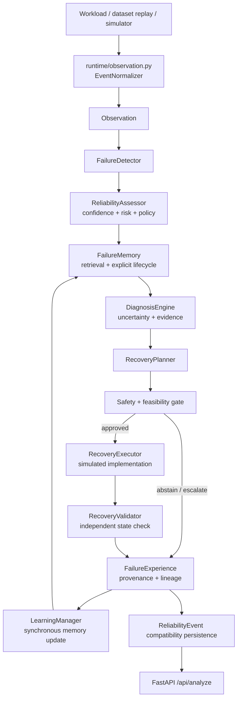

# Autonomous AI Infrastructure — Unified Reliability + Failure Memory

A research-grade, self-healing AI/ML infrastructure system: it observes AI/ML
workloads, estimates whether it should trust its own read of the situation,
retrieves similar past failures from persistent memory, and learns which
recovery action to take — evaluated with the same rigor a systems paper
would demand, not just shipped as a demo.

## Overview

Most "self-healing infrastructure" prototypes wire a single anomaly score
straight into a single remediation rule, which makes it hard to answer basic
research questions in isolation — does failure memory actually improve the
recovery decision? does a context-aware policy beat a hand-written heuristic?
This project is built the other way: confidence calibration, failure memory,
pattern discovery, and recovery selection are separate, independently
testable modules behind one decision policy, each with its own frozen
protocol, leakage audit, and oracle reference bound.

**Research question:** given calibrated confidence, persistent failure
memory, and a controlled recovery-selection environment, can a
context-aware, learned recovery policy detect and diagnose failures,
abstain when evidence is insufficient, and select a recovery action that
measurably beats a strong, non-learned heuristic — without exceeding a
zero-tolerance unsafe-action rate?

This is scoped to what's actually been run: two prior research prototypes
(audited, then rebuilt behind one architecture — see
[`docs/PHASE1_AUDIT_REPORT.md`](docs/PHASE1_AUDIT_REPORT.md)), extended
through a pre-registered, frozen-protocol experimental track on both real
operational datasets and a controlled recovery-selection environment — not
a claim of production deployment or open-ended generalization. See
[Known Limitations](#known-limitations).

## What It Can Do

- **Confidence + abstention** — a calibrated confidence signal
  (`reliability/`) fused with a persistent failure-memory risk signal
  (`failure_memory/`) behind one authoritative decision policy
  (`decision/policy.py`), migrated and rebuilt from the AI-Abstention-Engine
  and Introspective-Failure-Memory-Model prototypes.
- **Failure memory** — a canonical `FailureExperience` schema
  (`failure_experience/`) ingesting real operational data from three
  independent sources (AgentRx, AIOps 2020, Alibaba GPU 2020) plus
  synthetic data into one retrieval-ready corpus, 961/961 records ingested
  with zero provenance violations.
- **Failure pattern discovery** — failure-rate-elevation pattern mining on
  real GPU-cluster data (`failure_patterns/`), with a pre-registered
  evidence-volume gate rather than reporting whatever pattern count comes
  out.
- **Recovery learning** — a controlled, leakage-audited recovery-selection
  environment (`recovery/`) with an oracle reference bound, a
  non-strawman fixed-priority baseline, and an experience-based empirical
  policy with an explicit evidence-count abstention rule — evaluated
  single-step (4.3) and two-step/sequential-with-abstention (4.4).
- **Feasibility gating** — a reusable check
  (`src/recovery/feasibility.py`) that verifies a pre-registered minimum
  effect size is actually reachable given a baseline's headroom against
  the oracle bound, *before* a threshold is frozen — added after two
  phases froze thresholds without it (see [Current Results](#current-results-real-numbers)).
- **Canonical runtime controller** — `src/runtime/` now orchestrates structured observation, detection, reliability assessment, failure-memory retrieval, uncertain diagnosis, safety-gated recovery planning, simulated execution, independent validation, complete experience persistence, and synchronous memory updates.
- **Runtime API** — `api/app.py` routes `/api/analyze` through the canonical controller. The API default does not train from a benchmark dataset at startup; it honestly abstains until explicit model/calibrator artifacts are injected.
- **Deterministic closed-loop demonstration** — `scripts/run_closed_loop_demo.py` runs two simulated episodes and shows whether the second episode retrieves the first. This is an integration proof, not production recovery evidence.

Only capabilities that are actually implemented and evaluated are listed
here — see [Known Limitations](#known-limitations) for what isn't.

## Tech Stack

**Core** — Python, Pydantic (canonical event schema), SQLAlchemy + SQLite
(persistence), scikit-learn / numpy / pandas / scipy (calibration,
representations, statistics), FastAPI + Uvicorn (demo API), pytest (test
suite: unit / integration / e2e / recovery).

**Research infrastructure** — one `benchmarks/*.py` script per experiment
(deterministic given a fixed seed), one frozen protocol JSON per phase
under `configs/`, one results JSON per phase under `experiments/results/`
as the source of truth for every number in this README.

**Explicitly not used** — no Docker/CI pipeline yet, no frontend, no
message queue between components (direct module calls through
`pipeline_builder.py`), no ORM abstraction beyond SQLAlchemy's own.

## Architecture

The canonical runtime is now an explicit controller rather than the synthetic benchmark builder. Inputs arrive through an observation normalizer, then flow through detection, reliability/risk assessment, retrieval, diagnosis, recovery planning, safety and feasibility gating, simulated execution, independent validation, complete experience persistence, and synchronous learning updates. `ReliabilityEvent` remains a compatibility event at the persistence boundary; `FailureExperience` is the foundation for the complete runtime episode.



The synthetic `build_system()` function remains available as an explicitly named research builder for frozen benchmarks. The API uses `build_runtime_system()` and does not secretly train from a benchmark dataset during startup. Controlled recovery modules remain simulation/research infrastructure and are not production executors.

The baseline classification and migration map are recorded in [`docs/ARCHITECTURE_MAP_BASELINE.md`](docs/ARCHITECTURE_MAP_BASELINE.md). Full per-phase design detail remains under [`docs/`](docs/).

## Research Contributions

| Type | Contribution |
|---|---|
| Research | A calibrated confidence + persistent failure-memory fusion behind one decision policy, migrated from two independently-developed prototypes after a formal audit, not a naive merge |
| Research | A controlled, leakage-audited recovery-selection environment with an explicit oracle reference bound, used to test whether a learned policy beats a serious (non-strawman) fixed-priority baseline, single-step and two-step-with-abstention |
| Research | A feasibility-gate methodology (`src/recovery/feasibility.py`) that checks a pre-registered effect-size threshold against actual baseline-to-oracle headroom before freezing it — added retroactively after two phases skipped this check (see [Current Results](#current-results-real-numbers)) |
| Research | A canonical `FailureExperience` schema unifying three independent real operational datasets and synthetic data into one retrieval corpus, with a pre-registered evidence-volume gate for pattern discovery rather than reporting underpowered patterns as findings |
| Engineering | A leakage-audit discipline applied to every phase (7 → 9 → 12 checks as the environment grew), including a caught-and-fixed non-determinism bug (`hash()` seeding) that had silently flipped a verdict between runs |

Full breakdown: [`docs/PHASE4_PLAN.md`](docs/PHASE4_PLAN.md) and each
phase's own doc under `docs/`.

## Current Results (real numbers)

Tests before the architectural recovery: **432 passed / 17 skipped / 0 failed / 4 warnings**. After the repaired runtime: **439 passed / 17 skipped / 0 failed / 21 warnings**. After relevance-aware learning influence, small-sample guards, source adapters, provenance, and the new experiment tests: **444 passed / 17 skipped / 0 failed / 1 warning**. After the generalized simulator, multi-step recovery, and robustness tests: **453 passed / 17 skipped / 0 failed / 1 warning**. The remaining warning is an external Starlette/httpx deprecation; the avoidable PCA warnings were removed with mathematically valid guards. Every historical experiment result below remains frozen and was not overwritten.

| Phase | Question | Verdict | Headline number |
|---|---|---|---|
| 3.1–3.6 (frozen baseline) | Confidence + failure-memory detection, synthetic + real data | frozen | see [`PHASE3_FREEZE.md`](docs/PHASE3_FREEZE.md) |
| 4.1 — Failure Experience | Canonical schema across 4 real+synthetic sources | **PASS** | 961/961 ingested, 0 provenance violations |
| 4.2 — Pattern Learning | Failure-rate-elevation patterns on Alibaba GPU2020 | **INCONCLUSIVE** | 21/50 evaluable contexts — underpowered, not negative |
| 4.3 — Recovery Learning | Learned recovery policy vs. fixed-priority baseline | **PASS — not supported** | effect +0.011 vs. 0.15 required |
| 4.4 — Sequential Recovery | 2-step, history-aware policy vs. fixed-priority | **PASS — not supported** | effect −0.049 (significant, wrong direction) |
| New runtime learning influence | Validated experience affects future controlled decisions | **INTEGRATION RESULT** | relevant retrieval +1.0; action change 100%; validation success +1.0 in deterministic simulator |

**Both verdicts above are the recorded result. Full stop.** A separate,
**EXPLORATORY, POST-HOC, NOT PRE-REGISTERED** analysis (confirmed absent
from either frozen `configs/phase4_*_recovery_protocol.json` by direct
inspection) found that neither phase checked, before freezing its
0.15-point threshold, whether that much headroom existed between its
baseline and its own oracle bound — 4.3 had 0.060 points available (40%
of what was required), 4.4 had 0.029 (19%) — and that 4.4's negative
effect is largely attributable to its metric scoring abstention identically
to failure. This analysis does **not** change, soften, or reopen either
recorded verdict; it is a candidate hypothesis for a future,
properly pre-registered phase, nothing more. Full numbers, clearly marked
exploratory:
[`PHASE4_3_AMENDMENT_1_ORACLE_RELATIVE.md`](docs/PHASE4_3_AMENDMENT_1_ORACLE_RELATIVE.md),
[`PHASE4_4_AMENDMENT_1_ORACLE_RELATIVE_AND_ABSTENTION_CREDIT.md`](docs/PHASE4_4_AMENDMENT_1_ORACLE_RELATIVE_AND_ABSTENTION_CREDIT.md).

## New Runtime Learning-Influence Study

The new study is separate from frozen Phase 4. It uses a deterministic simulator with an explicit control condition (empty memory) and learned condition (one declared validated training episode), 20 evaluation episodes per condition, explicit relevance scores, and no evaluation-to-memory leakage. The learned condition retrieved one relevant experience per episode, increased diagnosis confidence from 0.6 to 0.8, reduced uncertainty from 0.4 to 0.2, changed the selected action from `retry` to `reconfigure` in 20/20 episodes, and improved simulator validation success from 0/20 to 20/20. Mean risk stayed at 0.0 because the default runtime has no injected workload model and does not fabricate one. These are controlled integration results, not production or statistical generalization claims. See [`docs/LEARNING_INFLUENCE_REPORT.md`](docs/LEARNING_INFLUENCE_REPORT.md) and [`experiments/results/learning_influence/`](experiments/results/learning_influence/).

## Generalization and Robustness Study

The next experiment is isolated under [`experiments/results/generalization/`](experiments/results/generalization/) and uses a new versioned protocol with four failure classes, stochastic action outcomes, five deterministic seeds, shifted related evaluation contexts, exact/related/irrelevant/conflicting/negative/safety/multi-step conditions, and a maximum of three recovery attempts. The current controlled results show **1.00 related-memory recovery success**, **1.00 relevance recall**, **0.00 irrelevant-memory relevance recall**, **1.00 abstention under conflicting memories**, **1.00 abstention under safety conflict**, and **0 retry selections** in the negative-experience condition. The no-memory and irrelevant-memory conditions achieve **0.65** recovery success under the declared simulator. These are multi-seed descriptive simulator results, not production or statistically significant benchmark claims. Full details are in [`docs/GENERALIZATION_EXPERIMENT_REPORT.md`](docs/GENERALIZATION_EXPERIMENT_REPORT.md).

## Counterfactual Behavioral-Generalization Study

The next experiment is isolated under [`experiments/results/counterfactual_generalization/`](experiments/results/counterfactual_generalization/) and tests genuine behavioral generalization rather than retrieval alone. It hides three latent mechanisms from the runtime, provides two distinct training manifestations per mechanism, and evaluates unseen A3/B3/C3 manifestations. It compares four predeclared baselines: B0 fixed retry, B1 nearest-neighbor action transfer, B2 the current memory-plus-planner runtime, and B3 an observable action-centroid baseline. The clean C7 counterfactual pair changes only memory availability and improves recovery success from **0.20 to 0.80**. C3 exact-memory removal retains **0.80** success, equal to exact training-memory performance in this simulator. The result is evidence of behavioral generalization within this hand-designed latent-mechanism simulator, not production robustness or statistical significance. See [`experiments/results/counterfactual_generalization/report.md`](experiments/results/counterfactual_generalization/report.md).

## Memory Composition and Planner Superiority Study

The new study is isolated under [`experiments/results/memory_composition/`](experiments/results/memory_composition/) and asks whether the full FailureMemory + Diagnosis + RecoveryPlanner path does more than copy one nearest historical action. The main X+Z compositional case passes a pre-evaluation discrimination check: E1 X-only and E3 Z-only are each insufficient, while the combined B2 path selects the declared safe abstention. On the five-seed headline evaluation, B1 nearest-only recovery success is **0.20**, B2 full-planner success is **0.00**, and B2 optimal-action rate is **1.00** versus B1 **0.00**. Thus B2 shows a decision-quality advantage in the declared compositional case but a recovery-success disadvantage because the correct action is abstention. The ordering test found a current runtime defect: reversing equally relevant memory order changed B2 between `abstain` and `reconfigure`; this is documented as a limitation rather than hidden. Per-seed results are condition-specific and do not aggregate unrelated baselines or distance bands. See [`experiments/results/memory_composition/report.md`](experiments/results/memory_composition/report.md).

## Memory Composition v2: Order-Invariant Planning Audit

The versioned follow-up is isolated under [`experiments/results/memory_composition_v2/`](experiments/results/memory_composition_v2/). The v1 defect was traced to ordinary floating-point score accumulation over retrieval order followed by exact maximum comparison, so equally relevant opposing evidence could select different actions under permutation. The runtime fix uses commutative `math.fsum` aggregation over evidence contributions and tolerance-aware tie handling; equal unresolved evidence abstains. V2 enumerates both relevant-memory permutations and the explicit equal-similarity tie, producing `abstain` for both orders with decision stability **1.00**. V2 also corrects the v1 ablation report’s namespace mismatch and separately reports recovery success, optimal decision rate, safe decision rate, abstention correctness, unsafe proposal rate, and unsafe execution rate. On C2, B2 retains recovery success **0.00** but reaches optimal decision rate **1.00**, abstention correctness **1.00**, and unsafe execution **0.00**; B1 remains at recovery **0.20** and optimal decision **0.00**. This is a decision-quality and safety result, not evidence of recovery-success superiority or production self-healing. See [`experiments/results/memory_composition_v2/report.md`](experiments/results/memory_composition_v2/report.md).

## Runtime Reliability and Observability Architecture Audit

The validated memory-composition/order-invariant checkpoint is complete, but the repository is not yet a genuine observable production runtime. The new read-only architecture audit distinguishes demonstrated mechanisms—failure-memory influence, local simulator generalization, counterfactual behavior, safety gating, negative evidence handling, order-invariant aggregation, compositional decisions, and deterministic reproducibility—from unsupported claims such as production self-healing, real-workload monitoring or prediction, production continual learning, broad real-world generalization, and statistical significance. It also defines the proposed telemetry contract and next runtime-integration phases without implementing them. See [`docs/RUNTIME_RELIABILITY_OBSERVABILITY_ARCHITECTURE_AUDIT.md`](docs/RUNTIME_RELIABILITY_OBSERVABILITY_ARCHITECTURE_AUDIT.md).

## Reliability Model Integration Audit

The current repository has no protocol-valid persisted workload model and calibrator artifact. The existing model and calibrator are in-memory research objects without a versioned artifact boundary and independent leakage manifest. The default runtime therefore remains the honest unconfigured abstainer with numerical risk `0.0`; no model is fabricated and no API startup training is introduced. See [`docs/RELIABILITY_MODEL_INTEGRATION_AUDIT.md`](docs/RELIABILITY_MODEL_INTEGRATION_AUDIT.md) and [`configs/runtime_demo/model_config.json`](configs/runtime_demo/model_config.json).

## Known Limitations

- **Simulated recovery, not production infrastructure** — the new runtime has an explicit `SimulatedRecoveryExecutor` and independent validator. The controlled 4.3/4.4 action outcomes still come from a frozen deterministic ground-truth table, and neither those results nor the new demonstration is evidence of real-world recovery-rate improvement.
- **Default API model is intentionally unconfigured** — `build_runtime_system()` does not train during startup. A versioned workload model and calibrator must be injected for calibrated ANSWER decisions; the default path abstains honestly rather than using synthetic training as hidden runtime initialization.
- **Two consecutive "hypothesis not supported" verdicts** on recovery learning (4.3, 4.4) — both traced to a specific, documented cause (threshold feasibility + abstention scoring, see [Current Results](#current-results-real-numbers)), not yet re-run under a corrected metric.
- **Phase 4.2 is underpowered, not negative** — 21 of a pre-registered 50 required evaluable contexts; the evidence-volume gate did what it was designed to do (block an overclaimed result), but the underlying question is still open.
- **Real-data-dependent tests require a manual data-fetch step** — 14 tests skip cleanly without it; see [`docs/DATA_SETUP.md`](docs/DATA_SETUP.md).
- **No production authentication, rate limiting, or deployment hardening** on the demo API.

Full detail: each phase's own doc under [`docs/`](docs/).

## Quick Start

```bash
python -m venv .venv
.venv/Scripts/pip install -r requirements.txt   # Windows; .venv/bin/pip on macOS/Linux

python -m pytest tests/ -v                       # 477 passed / 17 skipped / 1 external warning
python scripts/run_closed_loop_demo.py            # deterministic two-episode controller trace
python scripts/run_learning_influence.py          # frozen control-versus-learned experiment; do not overwrite its results
python scripts/run_generalization.py               # local retrieval-generalization experiment
python scripts/run_counterfactual_generalization.py  # latent-mechanism counterfactual experiment
python scripts/run_memory_composition.py        # v1 compositional memory/planner experiment
python scripts/run_memory_composition_v2.py     # v2 order-invariant planning and ablation audit
.venv/Scripts/uvicorn src.api.app:app --port 8000  # POST /api/analyze -> canonical runtime controller
```

## Reproducing Results

Every phase has its own `benchmarks/phase*.py` script(s), named in that
phase's doc under `docs/`, that regenerate its results deterministically
from a fixed seed and write to `experiments/results/`. Two are worth
calling out directly:

```bash
python benchmarks/amendment_oracle_relative_analysis.py         # 4.3 + 4.4 headroom-normalized reanalysis
python benchmarks/check_effect_size_feasibility.py \             # go/no-go check before freezing any future threshold
    --from-results experiments/results/phase4_3/results.json --baseline-key baseline_fixed_priority --required-effect 0.15
```

## Documentation

- [`docs/PHASE2_REPORT.md`](docs/PHASE2_REPORT.md) — the unified system: what changed from the two source prototypes, and why.
- [`docs/PHASE4_PLAN.md`](docs/PHASE4_PLAN.md) — the current research phase's plan and amendments.
- [`docs/DATA_SETUP.md`](docs/DATA_SETUP.md) — fetching/regenerating the real datasets locally.
- [`docs/SCHEMA.md`](docs/SCHEMA.md) — the compatibility `ReliabilityEvent` schema reference.
- [`docs/ARCHITECTURE_MAP_BASELINE.md`](docs/ARCHITECTURE_MAP_BASELINE.md) — pre-change architecture classification and target runtime map.
- [`docs/VERSIONED_MODULE_CLASSIFICATION.md`](docs/VERSIONED_MODULE_CLASSIFICATION.md) — v1/v2, research, runtime, and historical module boundaries.
- [`docs/LEARNING_INFLUENCE_REPORT.md`](docs/LEARNING_INFLUENCE_REPORT.md) — frozen control-versus-learned study and scientifically bounded interpretation.
- [`docs/GENERALIZATION_EXPERIMENT_REPORT.md`](docs/GENERALIZATION_EXPERIMENT_REPORT.md) — multi-seed shifted-context generalization, conflict, negative-memory, safety, and multi-step results.
- [`docs/RELIABILITY_MODEL_INTEGRATION_AUDIT.md`](docs/RELIABILITY_MODEL_INTEGRATION_AUDIT.md) — audit of available model/calibrator artifacts and explicit unconfigured-runtime decision.
- [`docs/RUNTIME_RELIABILITY_OBSERVABILITY_ARCHITECTURE_AUDIT.md`](docs/RUNTIME_RELIABILITY_OBSERVABILITY_ARCHITECTURE_AUDIT.md) — read-only audit of telemetry, detection, reliability, memory, diagnosis, recovery, validation, learning, and proposed next-phase interfaces.
- [`experiments/results/counterfactual_generalization/report.md`](experiments/results/counterfactual_generalization/report.md) — true/counterfactual behavioral-generalization experiment with latent mechanisms, baselines, distance ladder, negative transfer, and safety results.
- [`experiments/results/memory_composition/report.md`](experiments/results/memory_composition/report.md) — v1 compositional evidence, B1/B2 planner comparison, ablations, safety, negative transfer, and ordering robustness.
- [`experiments/results/memory_composition_v2/report.md`](experiments/results/memory_composition_v2/report.md) — v2 order-invariant aggregation fix, corrected ablation metrics, abstention semantics, and planner/safety audit.

Every phase has one doc under `docs/`; start from the verdict table above
and follow the link for the phase you need.
