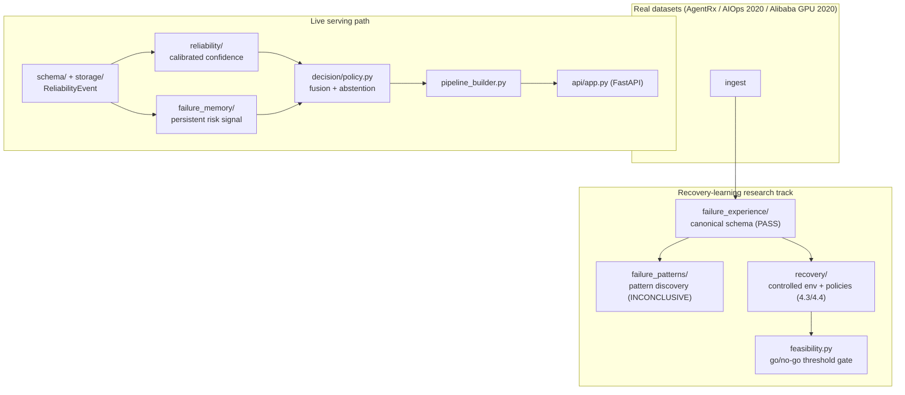

# Autonomous AI Infrastructure — Unified Reliability + Failure Memory

A research-grade, self-healing AI/ML infrastructure system: it observes AI/ML
workloads, estimates whether it should trust its own read of the situation,
retrieves similar past failures from persistent memory, and learns which
recovery action to take — evaluated with the same rigor a systems paper
would demand, not just shipped as a demo.

## Overview

Most "self-healing infrastructure" prototypes wire a single anomaly score
straight into a single remediation rule, which makes it hard to answer basic
research questions in isolation — does failure memory actually improve the
recovery decision? does a context-aware policy beat a hand-written heuristic?
This project is built the other way: confidence calibration, failure memory,
pattern discovery, and recovery selection are separate, independently
testable modules behind one decision policy, each with its own frozen
protocol, leakage audit, and oracle reference bound.

**Research question:** given calibrated confidence, persistent failure
memory, and a controlled recovery-selection environment, can a
context-aware, learned recovery policy detect and diagnose failures,
abstain when evidence is insufficient, and select a recovery action that
measurably beats a strong, non-learned heuristic — without exceeding a
zero-tolerance unsafe-action rate?

This is scoped to what's actually been run: two prior research prototypes
(audited, then rebuilt behind one architecture — see
[`docs/PHASE1_AUDIT_REPORT.md`](docs/PHASE1_AUDIT_REPORT.md)), extended
through a pre-registered, frozen-protocol experimental track on both real
operational datasets and a controlled recovery-selection environment — not
a claim of production deployment or open-ended generalization. See
[Known Limitations](#known-limitations).

## What It Can Do

- **Confidence + abstention** — a calibrated confidence signal
  (`reliability/`) fused with a persistent failure-memory risk signal
  (`failure_memory/`) behind one authoritative decision policy
  (`decision/policy.py`), migrated and rebuilt from the AI-Abstention-Engine
  and Introspective-Failure-Memory-Model prototypes.
- **Failure memory** — a canonical `FailureExperience` schema
  (`failure_experience/`) ingesting real operational data from three
  independent sources (AgentRx, AIOps 2020, Alibaba GPU 2020) plus
  synthetic data into one retrieval-ready corpus, 961/961 records ingested
  with zero provenance violations.
- **Failure pattern discovery** — failure-rate-elevation pattern mining on
  real GPU-cluster data (`failure_patterns/`), with a pre-registered
  evidence-volume gate rather than reporting whatever pattern count comes
  out.
- **Recovery learning** — a controlled, leakage-audited recovery-selection
  environment (`recovery/`) with an oracle reference bound, a
  non-strawman fixed-priority baseline, and an experience-based empirical
  policy with an explicit evidence-count abstention rule — evaluated
  single-step (4.3) and two-step/sequential-with-abstention (4.4).
- **Feasibility gating** — a reusable check
  (`src/recovery/feasibility.py`) that verifies a pre-registered minimum
  effect size is actually reachable given a baseline's headroom against
  the oracle bound, *before* a threshold is frozen — added after two
  phases froze thresholds without it (see [Current Results](#current-results-real-numbers)).
- **Demo API** — a FastAPI service (`api/app.py`) exposing the trained
  pipeline for live confidence/risk analysis, never mocked metrics.

Only capabilities that are actually implemented and evaluated are listed
here — see [Known Limitations](#known-limitations) for what isn't.

## Tech Stack

**Core** — Python, Pydantic (canonical event schema), SQLAlchemy + SQLite
(persistence), scikit-learn / numpy / pandas / scipy (calibration,
representations, statistics), FastAPI + Uvicorn (demo API), pytest (test
suite: unit / integration / e2e / recovery).

**Research infrastructure** — one `benchmarks/*.py` script per experiment
(deterministic given a fixed seed), one frozen protocol JSON per phase
under `configs/`, one results JSON per phase under `experiments/results/`
as the source of truth for every number in this README.

**Explicitly not used** — no Docker/CI pipeline yet, no frontend, no
message queue between components (direct module calls through
`pipeline_builder.py`), no ORM abstraction beyond SQLAlchemy's own.

## Architecture

Real events flow: **workload → `reliability/` (calibrated confidence) +
`failure_memory/` (persistent risk from past failures) → `decision/policy.py`
(the one authoritative fusion point) → `pipeline_builder.py` → `api/`.**
Real datasets feed a parallel research track: `failure_experience/`
(canonical schema) → `failure_patterns/` (pattern discovery) and
`recovery/` (the controlled recovery-selection environment behind Phases
4.3/4.4). Frozen, synthetic-only early-Phase-4 modules
(`experience/`, `patterns/`, un-suffixed `failure_memory/` paths) are not
on the live serving path.



Full architecture and per-phase design detail: [`docs/`](docs/), starting
with [`PHASE2_REPORT.md`](docs/PHASE2_REPORT.md) (the unified system) and
[`PHASE4_PLAN.md`](docs/PHASE4_PLAN.md) (the current research phase).

## Research Contributions

| Type | Contribution |
|---|---|
| Research | A calibrated confidence + persistent failure-memory fusion behind one decision policy, migrated from two independently-developed prototypes after a formal audit, not a naive merge |
| Research | A controlled, leakage-audited recovery-selection environment with an explicit oracle reference bound, used to test whether a learned policy beats a serious (non-strawman) fixed-priority baseline, single-step and two-step-with-abstention |
| Research | A feasibility-gate methodology (`src/recovery/feasibility.py`) that checks a pre-registered effect-size threshold against actual baseline-to-oracle headroom before freezing it — added retroactively after two phases skipped this check (see [Current Results](#current-results-real-numbers)) |
| Research | A canonical `FailureExperience` schema unifying three independent real operational datasets and synthetic data into one retrieval corpus, with a pre-registered evidence-volume gate for pattern discovery rather than reporting underpowered patterns as findings |
| Engineering | A leakage-audit discipline applied to every phase (7 → 9 → 12 checks as the environment grew), including a caught-and-fixed non-determinism bug (`hash()` seeding) that had silently flipped a verdict between runs |

Full breakdown: [`docs/PHASE4_PLAN.md`](docs/PHASE4_PLAN.md) and each
phase's own doc under `docs/`.

## Current Results (real numbers)

Tests (fresh run, not carried forward from an earlier report): **435
passed / 14 skipped, 0 failed** on a clean checkout with no local real-data
setup; **449 passed / 0 skipped** once the three small marker files listed
in [`docs/DATA_SETUP.md`](docs/DATA_SETUP.md) are present (well under 2 MB
total — the full multi-GB raw datasets are not required just to get a
green suite). Every number below is pulled from
`experiments/results/*/*.json`, not restated from memory.

| Phase | Question | Verdict | Headline number |
|---|---|---|---|
| 3.1–3.6 (frozen baseline) | Confidence + failure-memory detection, synthetic + real data | frozen | see [`PHASE3_FREEZE.md`](docs/PHASE3_FREEZE.md) |
| 4.1 — Failure Experience | Canonical schema across 4 real+synthetic sources | **PASS** | 961/961 ingested, 0 provenance violations |
| 4.2 — Pattern Learning | Failure-rate-elevation patterns on Alibaba GPU2020 | **INCONCLUSIVE** | 21/50 evaluable contexts — underpowered, not negative |
| 4.3 — Recovery Learning | Learned recovery policy vs. fixed-priority baseline | **PASS — not supported** | effect +0.011 vs. 0.15 required |
| 4.4 — Sequential Recovery | 2-step, history-aware policy vs. fixed-priority | **PASS — not supported** | effect −0.049 (significant, wrong direction) |

**Both verdicts above are the recorded result. Full stop.** A separate,
**EXPLORATORY, POST-HOC, NOT PRE-REGISTERED** analysis (confirmed absent
from either frozen `configs/phase4_*_recovery_protocol.json` by direct
inspection) found that neither phase checked, before freezing its
0.15-point threshold, whether that much headroom existed between its
baseline and its own oracle bound — 4.3 had 0.060 points available (40%
of what was required), 4.4 had 0.029 (19%) — and that 4.4's negative
effect is largely attributable to its metric scoring abstention identically
to failure. This analysis does **not** change, soften, or reopen either
recorded verdict; it is a candidate hypothesis for a future,
properly pre-registered phase, nothing more. Full numbers, clearly marked
exploratory:
[`PHASE4_3_AMENDMENT_1_ORACLE_RELATIVE.md`](docs/PHASE4_3_AMENDMENT_1_ORACLE_RELATIVE.md),
[`PHASE4_4_AMENDMENT_1_ORACLE_RELATIVE_AND_ABSTENTION_CREDIT.md`](docs/PHASE4_4_AMENDMENT_1_ORACLE_RELATIVE_AND_ABSTENTION_CREDIT.md).

## Known Limitations

- **Controlled recovery environment, not production infrastructure** — 4.3/4.4's action outcomes come from a frozen, deterministic ground-truth table over a 4-family scenario taxonomy, not a live production system; results are internally valid, not evidence of real-world recovery-rate improvement.
- **Two consecutive "hypothesis not supported" verdicts** on recovery learning (4.3, 4.4) — both traced to a specific, documented cause (threshold feasibility + abstention scoring, see [Current Results](#current-results-real-numbers)), not yet re-run under a corrected metric.
- **Phase 4.2 is underpowered, not negative** — 21 of a pre-registered 50 required evaluable contexts; the evidence-volume gate did what it was designed to do (block an overclaimed result), but the underlying question is still open.
- **Real-data-dependent tests require a manual data-fetch step** — 14 tests skip cleanly without it; see [`docs/DATA_SETUP.md`](docs/DATA_SETUP.md).
- **No production authentication, rate limiting, or deployment hardening** on the demo API.

Full detail: each phase's own doc under [`docs/`](docs/).

## Quick Start

```bash
python -m venv .venv
.venv/Scripts/pip install -r requirements.txt   # Windows; .venv/bin/pip on macOS/Linux

python -m pytest tests/ -v                       # 435 passed / 14 skipped without local real-data setup (docs/DATA_SETUP.md)
.venv/Scripts/uvicorn src.api.app:app --port 8000  # demo API -> POST /api/analyze, GET /api/metrics/summary
```

## Reproducing Results

Every phase has its own `benchmarks/phase*.py` script(s), named in that
phase's doc under `docs/`, that regenerate its results deterministically
from a fixed seed and write to `experiments/results/`. Two are worth
calling out directly:

```bash
python benchmarks/amendment_oracle_relative_analysis.py         # 4.3 + 4.4 headroom-normalized reanalysis
python benchmarks/check_effect_size_feasibility.py \             # go/no-go check before freezing any future threshold
    --from-results experiments/results/phase4_3/results.json --baseline-key baseline_fixed_priority --required-effect 0.15
```

## Documentation

- [`docs/PHASE2_REPORT.md`](docs/PHASE2_REPORT.md) — the unified system: what changed from the two source prototypes, and why.
- [`docs/PHASE4_PLAN.md`](docs/PHASE4_PLAN.md) — the current research phase's plan and amendments.
- [`docs/DATA_SETUP.md`](docs/DATA_SETUP.md) — fetching/regenerating the real datasets locally.
- [`docs/SCHEMA.md`](docs/SCHEMA.md) — the canonical `ReliabilityEvent` schema reference.

Every phase has one doc under `docs/`; start from the verdict table above
and follow the link for the phase you need.
