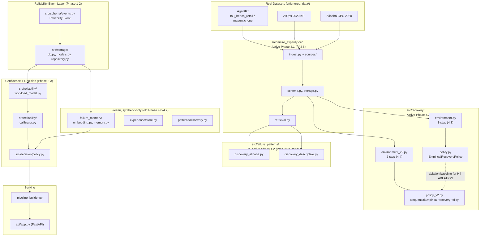
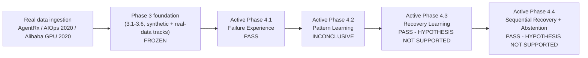

# Autonomous AI Infrastructure — Unified Reliability + Failure Memory

Phase 2 deliverable. A single, tested implementation combining a calibrated
confidence signal (migrated from `AI-Abstention-Engine`) and a persistent
failure-memory risk signal (migrated from `Introspective-Failure-Memory-
Model`) behind one decision policy, since extended through a real-data
failure-experience/pattern/recovery research track (Active Phases 4.1–4.4).
See [`docs/PHASE1_AUDIT_REPORT.md`](docs/PHASE1_AUDIT_REPORT.md) for the
source-prototype audit and [`docs/PHASE2_REPORT.md`](docs/PHASE2_REPORT.md)
for what changed and why, including the integration experiment's result.

> **Phase 3 (3.1–3.6) is frozen.** Future phases build upon, replace, or
> extend its components, but Phase 3 protocols, results, and conclusions
> are preserved as the historical experimental baseline — see
> [`docs/PHASE3_FREEZE.md`](docs/PHASE3_FREEZE.md).

> **Latest milestone: Active Phase 4.4 (Sequential Recovery with
> Abstention)** — verdict **PASS — HYPOTHESIS NOT SUPPORTED**. See the
> [metrics table](#metrics--verdicts-real-numbers) below and
> [`docs/PHASE4_4_PROTOCOL.md`](docs/PHASE4_4_PROTOCOL.md).

## Layout

```
src/
  schema/             canonical ReliabilityEvent (pydantic)
  storage/             SQLAlchemy persistence + repository
  reliability/          workload model + calibrated confidence
  failure_memory/        embedding, clustering, persistent storage-backed risk/retrieval
  decision/              the one authoritative decision policy
  data/                  synthetic regime-drift dataset generator
  evaluation/            Phase 3.1+ metrics (AUROC/AUPRC/ECE/AURC) + bootstrap CI + frozen protocol loader
  experience/            old (frozen) Phase 4.1 -- synthetic-only retrieval-precision experience store
  patterns/              old (frozen) Phase 4.2 -- synthetic-only failure pattern learning
  failure_experience/    Active Phase 4.1 -- canonical FailureExperience schema/storage/retrieval across real+synthetic sources (PASS)
  failure_patterns/      Active Phase 4.2 -- failure-rate-elevation pattern discovery (Alibaba primary) + descriptive recurrence analysis (AIOps/AgentRx), built on failure_experience (INCONCLUSIVE)
  recovery/               Active Phase 4.3 (1-step) + 4.4 (2-step sequential) -- controlled recovery-selection environment, baselines, proposed empirical policy (both PASS -- hypothesis not supported)
  pipeline_builder.py    trains one system (workload model + calibrator + failure memory)
  api/                    FastAPI demo service, built on pipeline_builder
benchmarks/      standardized risk-coverage harness + per-phase experiment/leakage-audit/evaluation scripts
experiments/results/  experiment outputs (JSON), reproducible via benchmarks/
tests/           unit / integration / e2e / recovery
configs/         policy thresholds + every phase's frozen protocol JSON
docs/            every phase's documentation, one file per phase (see the table of contents below)
```

## Setup

```bash
python -m venv .venv
.venv/Scripts/pip install -r requirements.txt   # Windows
# .venv/bin/pip install -r requirements.txt     # macOS/Linux
```

All dependencies are pinned to exact versions verified to install cleanly
from a fresh environment (see `requirements.txt`).

## Run the tests

```bash
python -m pytest tests/ -v
```

Some real-data-dependent tests (currently 5, gated by `require_alibaba_data`
/ `require_aiops_data` / `require_agentrx_data` fixtures in
`tests/conftest.py`) skip cleanly with a pointer to
[`docs/DATA_SETUP.md`](docs/DATA_SETUP.md) if the raw AgentRx/AIOps/Alibaba
datasets haven't been fetched locally (they're gitignored, not committed).
See the [metrics table](#metrics--verdicts-real-numbers) below for the
current pass count both ways.

## Reproduce the integration experiment

```bash
python benchmarks/run_baselines.py        # Baseline A vs B vs C, risk-coverage curves
python benchmarks/diagnose_risk_signal.py  # matched-coverage comparison + signal-quality diagnostics
```

Both are deterministic given the fixed seed (`SEED = 42` in
`benchmarks/run_baselines.py`) and write their output to
`experiments/results/`.

## Reproduce the Phase 3.1 evaluation (leakage audit + multi-seed baseline reproduction)

```bash
python benchmarks/phase3_1_leakage_audit.py   # 7 leakage checks against a live-built system
python benchmarks/phase3_1_evaluate.py        # AUROC/AUPRC/ECE/AURC/precision&recall, 6 seeds + bootstrap CI
```

Protocol is frozen in `configs/phase3_1_protocol.json`; full writeup in
[`docs/PHASE3_1_EVALUATION_PROTOCOL.md`](docs/PHASE3_1_EVALUATION_PROTOCOL.md).
Does not modify anything under
`src/pipeline_builder.py`, `src/failure_memory/`, or `src/reliability/` —
it evaluates the existing Phase 2 components under a new, stricter protocol.

## Reproduce the Phase 3.2 representation experiments

```bash
python benchmarks/phase3_2_evaluate.py   # Candidate B (raw features) + Candidate C (failure-history), same frozen protocol
```

Full writeup: [`docs/PHASE3_2_REPRESENTATION_EXPERIMENTS.md`](docs/PHASE3_2_REPRESENTATION_EXPERIMENTS.md).
Does not modify the Phase 3.1 protocol or any Phase 2 component; new
representations live only in `src/evaluation/representations.py`, used for
evaluation only (not wired into `src/decision` or the live API).

## Run the demo API

```bash
.venv/Scripts/uvicorn src.api.app:app --port 8000
```

`POST /api/analyze` with `{"context": {"f1": 0.1, "f2": -0.3, ...}}`;
`GET /api/metrics/summary` for real, computed-on-request metrics (never
mocked — see [`docs/PHASE2_REPORT.md`](docs/PHASE2_REPORT.md) section 2).

## Reproduce the Active Phase 4.1 failure-experience pipeline

```bash
python benchmarks/phase4_1_active_experiments.py   # Experiments A-E: completeness, information preservation, outcome fidelity, temporal integrity, provenance integrity
python benchmarks/phase4_1_leakage_audit.py
```

Ingests all four sources (307 synthetic + 73 AgentRx + 500 Alibaba + 81
AIOps = 961 total) into the canonical `FailureExperience` schema
(`src/failure_experience/`). Full writeup:
[`docs/PHASE4_1_ACTIVE_FAILURE_EXPERIENCE.md`](docs/PHASE4_1_ACTIVE_FAILURE_EXPERIENCE.md).

## Reproduce the Active Phase 4.2 failure-pattern-learning experiments

```bash
python benchmarks/phase4_2_active_pattern_evaluate.py    # Alibaba H2 discovery/validation/frozen-test-eval + baselines + ablations; AIOps/AgentRx descriptive; synthetic methodological validation
python benchmarks/phase4_2_active_leakage_audit.py        # 7 leakage checks, incl. a non-vacuous train-contamination test
```

Protocol is frozen in `configs/phase4_2_active_pattern_protocol.json`; full
writeup, results, and final verdict (**INCONCLUSIVE** — a pre-registered
`minimum_evaluable_n=50` evidence-volume gate was not met, 21 evaluable
test-split contexts) in
[`docs/PHASE4_2_ACTIVE_FAILURE_PATTERNS.md`](docs/PHASE4_2_ACTIVE_FAILURE_PATTERNS.md).
Consumes `src/failure_experience/` (Active Phase 4.1) as its data layer;
does not modify or import the old, frozen `src/patterns/` (also
`INCONCLUSIVE`, on unrelated synthetic data — that verdict is untouched by
this milestone).

## Reproduce the Active Phase 4.3 recovery-learning experiments

```bash
python benchmarks/phase4_3_generate_dataset.py       # TRAIN/VALIDATION/TEST controlled recovery episodes
python benchmarks/phase4_3_recovery_leakage_audit.py  # 9 leakage checks
python benchmarks/phase4_3_recovery_evaluate.py       # frozen TEST evaluation, all baselines + proposed policy, H3/H3-SAFETY/H3-UTILITY
python benchmarks/phase4_3_seed_sensitivity_full.py    # supplementary independent-seed sensitivity range
```

Protocol frozen in `configs/phase4_3_recovery_protocol.json`. Single-step
(act → validate) controlled recovery environment (`src/recovery/`).
Verdict **PASS — HYPOTHESIS NOT SUPPORTED**: proposed policy beat a random
baseline decisively but was statistically indistinguishable from a
well-designed fixed-priority baseline. Full writeup:
[`docs/PHASE4_3_RECOVERY_LEARNING.md`](docs/PHASE4_3_RECOVERY_LEARNING.md).

## Reproduce the Active Phase 4.4 sequential-recovery experiments

```bash
python benchmarks/phase4_4_noise_sweep.py             # VALIDATION-only observation-noise calibration sweep (freezes observation_noise_rate)
python benchmarks/phase4_4_generate_dataset.py        # TRAIN/VALIDATION/TEST 2-step controlled recovery episodes
python benchmarks/phase4_4_recovery_leakage_audit.py  # 12 leakage checks (4.3's 9 adapted + 3 new)
python benchmarks/phase4_4_recovery_evaluate.py       # frozen TEST evaluation, H4/H4-SAFETY/H4-UTILITY/H4-ABSTENTION/H4-ABLATION
python benchmarks/phase4_4_seed_sensitivity.py         # independent-seed sensitivity range, built in from the start
```

Protocol frozen in `configs/phase4_4_recovery_protocol.json`. Extends 4.3
to a 2-step budget with a noisy intermediate observation
(`src/recovery/environment_v2.py`, `policy_v2.py`), testing whether
history-conditioning lets a learned policy beat a fixed rule where a
single decision point couldn't. Verdict **PASS — HYPOTHESIS NOT
SUPPORTED**: full writeup [`docs/PHASE4_4_PROTOCOL.md`](docs/PHASE4_4_PROTOCOL.md).

## Development database

A local SQLite file is created automatically at `data/unified_dev.db` on
first use. It starts empty; no personal data or credentials are ever
seeded into it (see [`docs/PHASE1_AUDIT_REPORT.md`](docs/PHASE1_AUDIT_REPORT.md)
section 5/11 on the source `reliability.db` issue this project deliberately
avoids repeating). It is excluded from version control via `.gitignore`.

---

## System architecture

Boxes are real modules under `src/`; arrows show actual data flow in the
current codebase, not an idealized target. "Legacy" modules are frozen,
synthetic-only, and not on the live serving path.



## Research / experiment pipeline

Phase progression, each node labeled with its actual verdict.



## Metrics & verdicts (real numbers)

Every number below is pulled from the current `experiments/results/*/*.json`
files in this repo, not from any prior draft of this README.

| Phase | What was tested | Verdict | Key numbers |
|---|---|---|---|
| Active 4.1 — Failure Experience | Canonical `FailureExperience` ingestion/representation across 4 sources (Experiments A–E: completeness, information preservation, outcome fidelity, temporal integrity, provenance integrity) | **PASS** | 961/961 records ingested (307 synthetic + 73 AgentRx + 500 Alibaba + 81 AIOps); 0 lineage/provenance violations |
| Active 4.2 — Pattern Learning | Failure-rate-elevation pattern discovery on Alibaba GPU2020 (Method C vs. baseline B), evidence-volume gate `minimum_evaluable_n=50` | **INCONCLUSIVE** | 21/50 evaluable test-split contexts (gate not met); leakage audit 7/7; Method C precision 0.333 / recall 0.667 on the 21 evaluable (underpowered, not a negative result) |
| Active 4.3 — Recovery Learning | Single-step (act→validate) `EmpiricalRecoveryPolicy` vs. `FixedPriorityPolicy`/`RandomValidPolicy`, H3 (min effect 0.15, McNemar α=0.05) | **PASS — HYPOTHESIS NOT SUPPORTED** | proposed 55.1% vs. fixed 54.0% vs. random 22.5% validated success (n=720); effect **+0.0111** vs. required 0.15, p=0.4505 (not significant); unsafe-action rate 0.0%; leakage audit 9/9 |
| Active 4.4 — Sequential Recovery + Abstention | 2-step `SequentialEmpiricalRecoveryPolicy` vs. `FixedPrioritySequential`, H4/H4-SAFETY/H4-UTILITY/H4-ABSTENTION/H4-ABLATION | **PASS — HYPOTHESIS NOT SUPPORTED** | proposed 70.3% vs. fixed-priority-sequential 75.1% validated success (n=700); effect **-0.0486** vs. required 0.15, p=0.00022 (significant, wrong direction); sensitivity range [-0.0671, -0.0386] across 4 independent seed draws; unsafe-action rate 0.0%; leakage audit 12/12 |

**Repo health (this session, real run):** `python -m pytest -q` → **441
passed, 0 failed, 0 skipped** with local real-data setup present (per
[`docs/DATA_SETUP.md`](docs/DATA_SETUP.md)). Without local data setup, the
5 tests gated by `require_alibaba_data`/`require_aiops_data`/
`require_agentrx_data` (see `tests/conftest.py`) skip cleanly instead of
erroring, giving **436 passed / 5 skipped** on a clean checkout.

## Project History & Documentation

Every phase's full report now lives under `docs/`, one file per phase —
split out of a single 12,000-line concatenated README (verbatim, nothing
reworded or summarized away). **FROZEN HISTORICAL** documents are sealed
research artifacts, reproduced exactly as originally written; **ACTIVE**
documents describe the current, in-force implementation.

**Phase 1–2 (migration)**
- [PHASE1_AUDIT_REPORT.md](docs/PHASE1_AUDIT_REPORT.md) — *FROZEN* — audit of the two source prototypes before migration.
- [PHASE2_REPORT.md](docs/PHASE2_REPORT.md) — *FROZEN* — migration/integration into one unified system.
- [SCHEMA.md](docs/SCHEMA.md) — *FROZEN* — canonical `ReliabilityEvent` schema reference (still in active use).

**Phase 3 — synthetic-data track (frozen baseline)**
- [PHASE3_1_EVALUATION_PROTOCOL.md](docs/PHASE3_1_EVALUATION_PROTOCOL.md) — frozen evaluation protocol.
- [PHASE3_2_REPRESENTATION_EXPERIMENTS.md](docs/PHASE3_2_REPRESENTATION_EXPERIMENTS.md) — representation experiments.
- [PHASE3_2C_CANDIDATE_ABLATION.md](docs/PHASE3_2C_CANDIDATE_ABLATION.md) — candidate representation ablation.
- [PHASE3_3_GENERALIZATION.md](docs/PHASE3_3_GENERALIZATION.md) — generalization evaluation.
- [PHASE3_4_COMPARISON.md](docs/PHASE3_4_COMPARISON.md) — comparison of representations/signals.
- [PHASE3_5_ATTACK_GENERALIZATION.md](docs/PHASE3_5_ATTACK_GENERALIZATION.md) — attack-generalization evaluation.
- [PHASE3_6_DIAGNOSIS_ABSTENTION_RECOVERY.md](docs/PHASE3_6_DIAGNOSIS_ABSTENTION_RECOVERY.md) — diagnosis/abstention/recovery study.
- [PHASE3_FREEZE.md](docs/PHASE3_FREEZE.md) — formal freeze declaration sealing 3.1–3.6.

**Old Phase 4.0–4.2 (synthetic-only, frozen; superseded in role by Active 4.1/4.2, not in content)**
- [PHASE4_0_EPISODIC_DATA.md](docs/PHASE4_0_EPISODIC_DATA.md) — synthetic episodic incident-stream generator.
- [PHASE4_1_FAILURE_MEMORY.md](docs/PHASE4_1_FAILURE_MEMORY.md) — synthetic-only failure memory/retrieval (H1 PARTIALLY SUPPORTED).
- [PHASE4_2_FAILURE_PATTERNS.md](docs/PHASE4_2_FAILURE_PATTERNS.md) — synthetic-only failure pattern learning (H2 INCONCLUSIVE).

**Real-data expansion & revised Phase 3 track (frozen)**
- [PHASE3_REAL_DATA_FEASIBILITY_AUDIT.md](docs/PHASE3_REAL_DATA_FEASIBILITY_AUDIT.md) — feasibility audit (AgentRx, AIOps 2020, Alibaba GPU 2020).
- [PHASE3_REAL_DATA_ALIBABA_SENSOR_LEAKAGE_GATE.md](docs/PHASE3_REAL_DATA_ALIBABA_SENSOR_LEAKAGE_GATE.md) — Alibaba sensor-feature leakage gate.
- [PHASE3_REAL_DATA_CLEANING_REPORT.md](docs/PHASE3_REAL_DATA_CLEANING_REPORT.md) — real-data cleaning/sampling/preparation.
- [PHASE3_REAL_DATA_AIOPS_PROTOCOL.md](docs/PHASE3_REAL_DATA_AIOPS_PROTOCOL.md) — AIOps 2020 extraction/evaluation protocol.
- [PHASE3_REAL_DATA_AIOPS_NEGATIVE_WINDOW_PROTOCOL.md](docs/PHASE3_REAL_DATA_AIOPS_NEGATIVE_WINDOW_PROTOCOL.md) — AIOps negative-window sampling protocol.
- [PHASE3_REAL_DATA_AIOPS_PREPARATION_COMPLETE.md](docs/PHASE3_REAL_DATA_AIOPS_PREPARATION_COMPLETE.md) — AIOps preparation completion record.
- [PHASE3_REAL_DATA_PROTOCOL.md](docs/PHASE3_REAL_DATA_PROTOCOL.md) — overall frozen real-data Phase 3 protocol.
- [PHASE3_REAL_DATA_3_1_REPORT.md](docs/PHASE3_REAL_DATA_3_1_REPORT.md) — real-data Phase 3.1 (detection) report.
- [PHASE3_REAL_DATA_3_2_REPORT.md](docs/PHASE3_REAL_DATA_3_2_REPORT.md) — real-data Phase 3.2 (representation) report.
- [PHASE3_REAL_DATA_3_3_REPORT.md](docs/PHASE3_REAL_DATA_3_3_REPORT.md) — real-data Phase 3.3 (generalization) report.
- [PHASE3_REAL_DATA_3_4_REPORT.md](docs/PHASE3_REAL_DATA_3_4_REPORT.md) — real-data Phase 3.4 (comparison) report.
- [PHASE3_REAL_DATA_3_5_REPORT.md](docs/PHASE3_REAL_DATA_3_5_REPORT.md) — real-data Phase 3.5 (attack/generalization) report.
- [PHASE3_REAL_DATA_3_6_DECISION.md](docs/PHASE3_REAL_DATA_3_6_DECISION.md) — real-data Phase 3.6 final decision (triggered the Phase 4 reassessment).
- [PHASE3_REAL_DATA_COMPARISON.md](docs/PHASE3_REAL_DATA_COMPARISON.md) — cross-dataset real-data comparison summary.

**Active Phase 4 (current)**
- [PHASE4_PLAN.md](docs/PHASE4_PLAN.md) — the Phase 4 master plan, with additive amendments (nothing rewritten).
- [PHASE4_1_ACTIVE_FAILURE_EXPERIENCE.md](docs/PHASE4_1_ACTIVE_FAILURE_EXPERIENCE.md) — *ACTIVE, PASS* — current `FailureExperience` substrate.
- [PHASE4_2_ACTIVE_PLAN.md](docs/PHASE4_2_ACTIVE_PLAN.md) — Active Phase 4.2's approved research plan.
- [PHASE4_2_ACTIVE_FAILURE_PATTERNS.md](docs/PHASE4_2_ACTIVE_FAILURE_PATTERNS.md) — *ACTIVE, INCONCLUSIVE* — implementation, experiments, final verdict (also carries the Active Phase 4.3 completion amendment).
- [PHASE4_3_RECOVERY_LEARNING.md](docs/PHASE4_3_RECOVERY_LEARNING.md) — *ACTIVE, PASS — HYPOTHESIS NOT SUPPORTED* — single-step recovery learning.
- [PHASE4_4_PROTOCOL.md](docs/PHASE4_4_PROTOCOL.md) — *ACTIVE, PASS — HYPOTHESIS NOT SUPPORTED* — frozen protocol for sequential (2-step) recovery with abstention.

**Other reference docs**
- [DATA_SETUP.md](docs/DATA_SETUP.md) — how to fetch/regenerate the real datasets locally.
