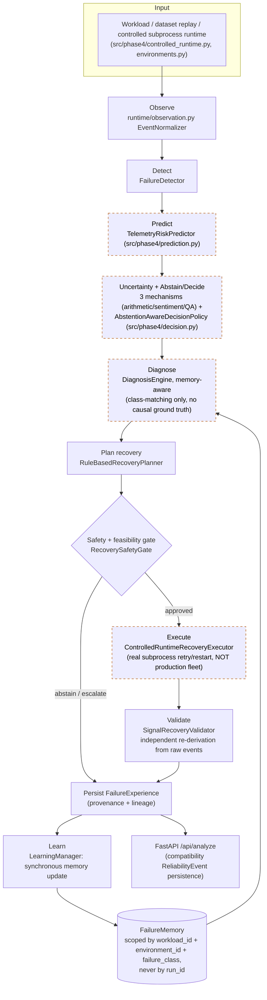

# System Architecture — Overview / Control Loop

Solid boxes are implemented, exercised by tests, and have at least one
evidence artifact under `experiments/results/`. Dashed boxes are
implemented as code paths but are either simulated/controlled-environment
only, or their evidence is aggregate-only / `NOT_EVALUABLE` at record
level — see the legend.

## Legend

- **Solid border** — real implementation, real tests, real evidence
  artifact (e.g. detection, planning, memory persistence, the safety
  gate, the 6-case adversarial safety matrix at 0 incorrectly authorized).
- **Dashed border (orange)** — implemented and runs for real, but the
  evidence backing it is either simulated/controlled-environment only
  (recovery execution against this project's own controlled subprocess
  runtime, not a production fleet), a narrow class-matching claim with no
  causal ground truth (diagnosis), or evaluated only in aggregate, not at
  record level (prediction: 3 of 4 `PRED-*` failure classes are
  `NOT_VALIDATED`/underpowered at the operating point; all 4 are
  `NOT_EVALUABLE` in the Phase 5.2 benchmark dataset).

This loop is the same one described in the root `README.md` and built out
in `src/phase4/pipeline.py` (`AutonomyPipeline`). It replaces the earlier
synthetic `build_system()` benchmark builder as the canonical runtime path;
`build_system()` remains available separately for frozen Phase 3/4
benchmarks only.
