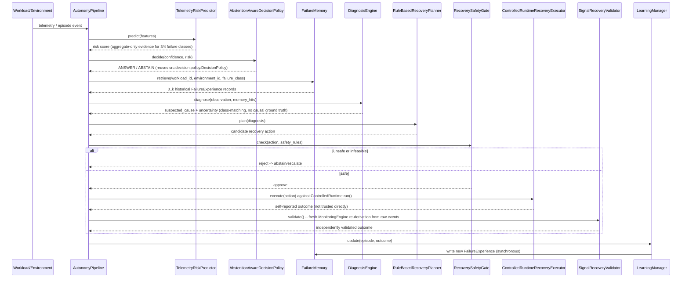

# Autonomy Control Loop — Detail

Expands the single `AutonomyPipeline.run_episode()` call
(`src/phase4/pipeline.py`) into its concrete component classes.

## What this demonstrates vs. does not

- **Demonstrated**: the pipeline runs end to end against this project's own
  controlled subprocess runtime; validation independently re-derives the
  outcome rather than trusting the executor's self-report (tested against
  a deliberately lying executor); memory measurably changed the planner's
  chosen action across repeated incidents of the same workload in the
  Phase 4.4/5 demo run.
- **Not demonstrated**: production-fleet recovery, statistically
  significant recovery-rate improvement (`REC-EVAL` benchmark result is
  0/35 `RECOVERED` on the Phase 5.2 dataset slice), or causally verified
  diagnosis (false-causal-attribution-rate = 1.0 because no independent
  causal ground truth exists in either the Phase 4 demo or the Phase 5.2
  dataset).
