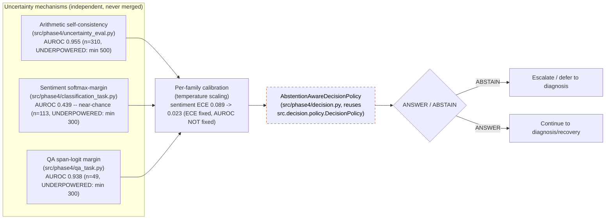

# Uncertainty + Abstention Architecture

Three **distinct, never-merged** uncertainty mechanisms feed one shared
abstention-aware decision policy. Each mechanism has its own metric
family, its own sample-size gate, and its own status — they are not
pooled into one "uncertainty score."

## Why they are never merged

- Each family has a genuinely different discrimination ceiling: sentiment
  is near-chance (0.439) even after calibration fixed its ECE, because
  temperature scaling corrects *calibration* (probabilities matching
  observed frequencies), not *discrimination* (AUROC). Averaging it with
  arithmetic's 0.955 would hide a real negative finding.
- All three are `UNDERPOWERED`, not `VALIDATED` or `NOT_VALIDATED` — the
  frozen minimum-sample gates (500 / 300 / 300) were not met in the
  Phase 5.2 test split (310 / 113 / 49). The point estimates are real
  measurements, not claims of statistical significance.
- The benchmark's `ABST-ARITH` / `ABST-SENT` / `ABST-QA` tasks are
  `PARTIALLY_VALIDATED` and explicitly flagged
  `SIMULATED_POLICY_EVALUATION`: no realized ABSTAIN/RETRY-decision
  episode exists in the ingested raw sources, so selective-risk numbers
  describe a simulated policy applied post hoc to labeled records, not an
  agent's actual historical abstention behavior.
