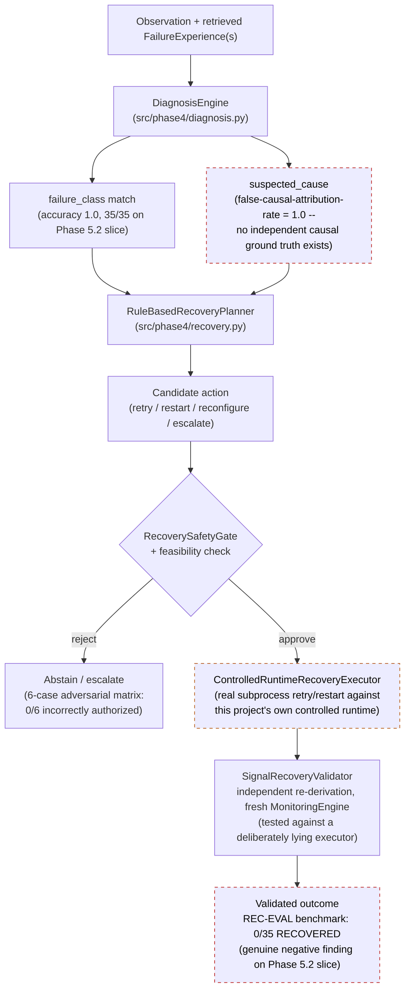

# Diagnosis + Recovery Architecture

## Two separate claims that must never be merged

1. **Ranking generalization** (Phase 4's own environment-generalization
   study): OOM failure-ranking AUROC transfers well across environments —
   dev 0.989, held-out 0.983, robustness 0.935.
2. **Operating-point generalization**: the *fixed decision threshold* does
   **not** transfer cleanly across those same environments. A model that
   ranks well can still make the wrong accept/reject call at a fixed
   threshold in a new environment.

These are reported as two distinct findings throughout this project's
documentation, never collapsed into one "generalizes" claim. Both are
Phase 4 aggregate-level findings; the Phase 5.2 canonical dataset has only
1 represented environment, so `GEN-RANKING-CONTRACT` and
`GEN-OPERATING-POINT-CONTRACT` are `NOT_EVALUABLE` at record level in the
benchmark, and the Phase 4 numbers above are preserved only as
aggregate-reference evidence, never attached to Phase 5.2 records.
