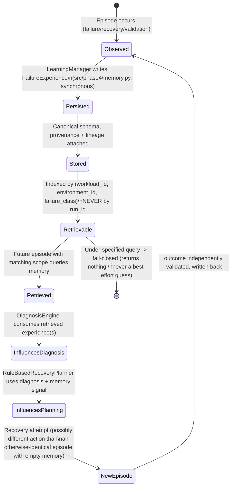

# Failure-Memory Lifecycle

## Two separate memory findings, never conflated

- **Phase 4 aggregate finding (real behavior change under real restarts)**:
  a repeated-incident experiment showed memory ON produces
  retry → retry → reconfigure → recovered, while memory OFF produces
  retry ×6, on the project's own controlled subprocess runtime — a real,
  measured behavior difference.
- **Phase 5.2 benchmark dataset (`MEM-EVAL`) — `NOT_EVALUABLE`**: the
  canonical dataset has only a single group of 3 repeated-workload
  records (`workload-recurring`), far below any scale that would support a
  memory-adaptation benchmark claim. The Phase 4 aggregate finding above is
  real and stands on its own; it is not re-derivable as a record-level
  benchmark score, and the benchmark package does not attempt to present
  it as one.

The memory contract itself (`src/phase4/memory.py`) was written and frozen
*before* any memory-read path was added to diagnosis, is versioned, and is
fail-closed on under-specified queries — this predates and is independent
of the benchmark dataset's limited memory-adaptation evidence.
