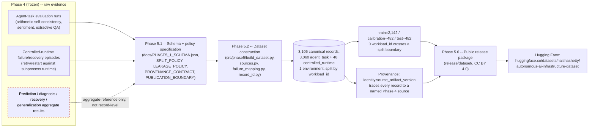

# Dataset Construction / Provenance Pipeline

Aggregate-only Phase 4 evidence (dashed, red) is deliberately **not**
converted into fabricated per-record values anywhere in this pipeline —
this is enforced by the Phase 5.1 provenance contract and verified by the
Phase 5.6 release audits (`LICENSE_PROVENANCE_AUDIT.md`,
`DATASET_RELEASE_AUDIT.md`).
