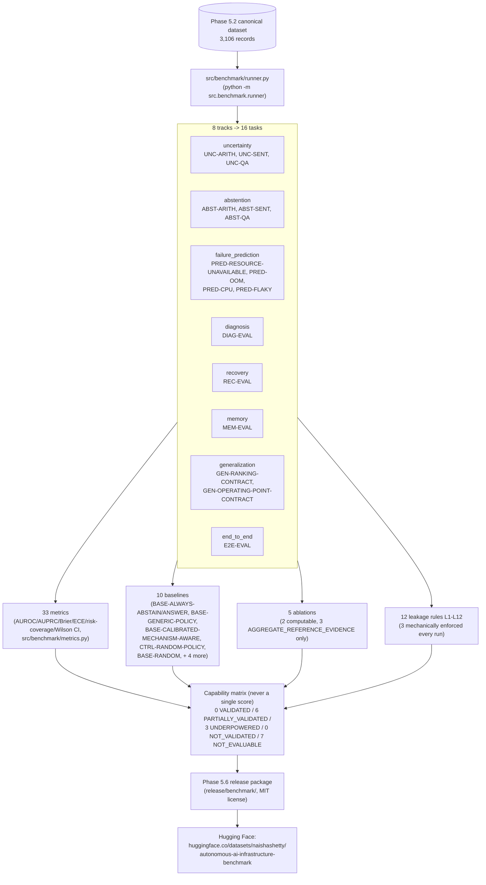

# Benchmark Architecture

The benchmark deliberately has **no aggregate "overall score"** — the
capability matrix (see `BENCHMARK_CARD.md` and `README.md`) is the
intended unit of reporting, read left to right, status column and all.
