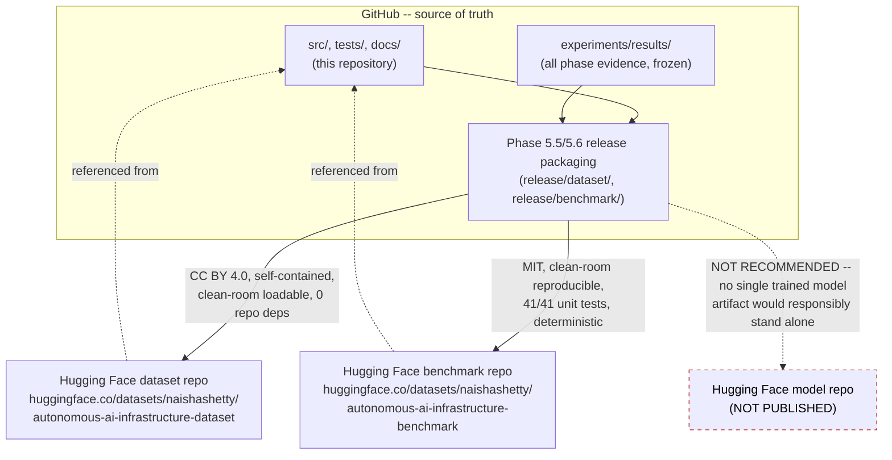

# Public Release Architecture

- GitHub remains the canonical source repository: all code, tests, and the
  full evidence trail under `experiments/results/`.
- Hugging Face hosts two release packages, both derived from and
  cross-linked back to this repository, never the reverse — the packages
  are self-contained (no dependency back on this repo to load or run).
- No model repository was published. The Phase 5.6 `RELEASE_DECISION.md`
  documents why: no single trained model artifact in this project (the
  `RiskPredictor` / `PredictionScopeRouter` behind the 4 `PRED-*` tasks) is
  independently validated at record level, so publishing one risks a
  reader treating an aggregate-only or explicitly `NOT_EVALUABLE`
  predictor as a usable trained model.
- This Phase 6 finalization work does **not** push anything to GitHub's
  `origin` remote and does **not** touch either Hugging Face repository —
  see `FINAL_RELEASE_CHECKLIST.md` for the explicit local-only commit/tag
  boundary.
