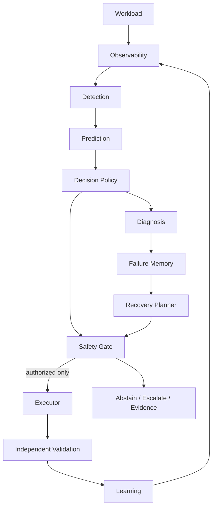

# PHASE 4.0 — ARCHITECTURE & SYSTEM CONTRACT

## Architecture

The model, planner, and language-model components have no direct infrastructure capability. Only an explicit safety gate can authorize an action for the executor.

## Component responsibility contract

| Component | Inputs | Outputs | Forbidden responsibility | Safety/provenance requirement |
|---|---|---|---|---|
| Observability | source events | normalized events, snapshots | diagnosis or recovery | timestamps and provenance required |
| Detection | observations | anomaly/failure evidence | action execution | evidence must be traceable |
| Prediction | decision snapshot | prediction with snapshot reference | infrastructure mutation | frozen model provenance |
| Decision policy | prediction | ACT/ABSTAIN/ESCALATE/REQUEST_MORE_EVIDENCE | direct execution | explicit rationale |
| Safety gate | decision and action | authorization | policy override | authorization required |
| Diagnosis | events and evidence | structured causes | causal certainty without evidence | provenance and timestamp |
| Planner | diagnosis | structured recovery action | direct execution | preconditions and validation |
| Executor | authorized action | execution result | override or autonomous plan change | authorization recorded |
| Validator | execution and observations | RECOVERED/NOT_RECOVERED/UNKNOWN | equate execution with recovery | independent evidence |
| Learning | validated outcomes | versioned update proposal | silently changing V1 | additive provenance |
| Orchestrator | component outputs | lifecycle coordination | bypassing gates | event correlation |

## State machine

Allowed lifecycle states are RECEIVED, OBSERVING, PREDICTED, DECIDING, REQUESTING_EVIDENCE, ABSTAINED, ESCALATED, DIAGNOSING, PLANNING, SAFETY_CHECK, EXECUTING, VALIDATING, RECOVERED, NOT_RECOVERED, UNKNOWN, and COMPLETED. Transitions are deterministic and invalid transitions raise an explicit error. Terminal states are RECOVERED, NOT_RECOVERED, UNKNOWN, and COMPLETED; NOT_RECOVERED may re-enter DIAGNOSING or complete.

## Event, decision-time, and provenance contracts

Phase 4 reuses the Phase 3.11+3.12 canonical event taxonomy. Every prediction references a decision snapshot containing only information classified AVAILABLE_BEFORE_DECISION or AVAILABLE_AT_DECISION. Timestamp-unknown, post-decision, and post-outcome information is rejected from proven snapshots. Decisions retain source, record, transformation, schema, timestamp-quality, and checksum provenance.

## Recovery and validation

Recovery actions carry identity, type, preconditions, expected effect, risk, cost, reversibility, authorization, validation requirements, and provenance. Execution success is not recovery success. Validation independently returns RECOVERED, NOT_RECOVERED, or UNKNOWN.

## Error semantics

Invalid input, schema, timestamp, provenance, missing evidence, stale state, unavailable observation, unsafe action, execution, validation, unknown outcome, and internal failures remain distinct error categories. Errors cannot silently become successful states.

## Phase 4.0 gate

| Gate | Result |
|---|---|
| Architecture | READY |
| Interfaces | READY |
| State machine | READY |
| Decision-time integrity | READY |
| Provenance | READY |
| Safety boundary | READY |
| Contract tests | PASS — 7 focused tests |

The Phase 4.0 gate passed before runtime observability implementation proceeded.
