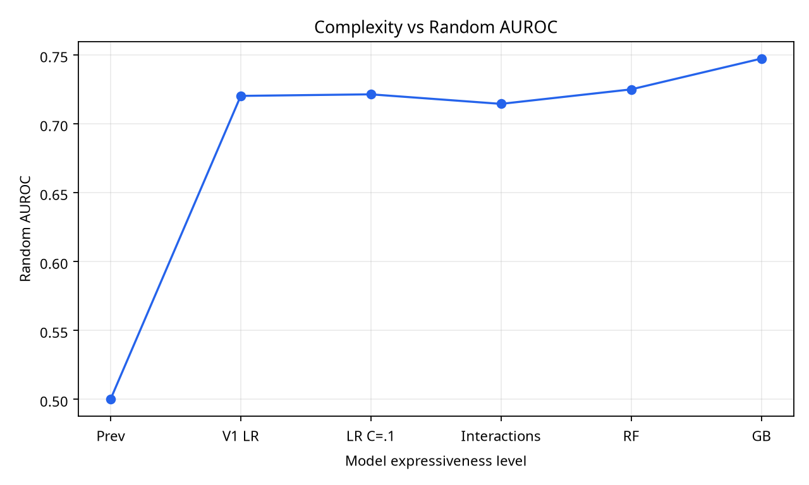
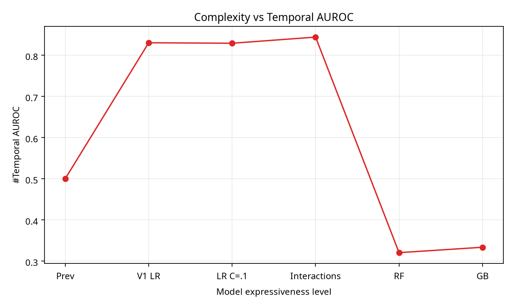
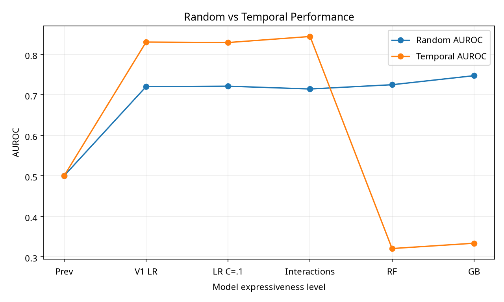
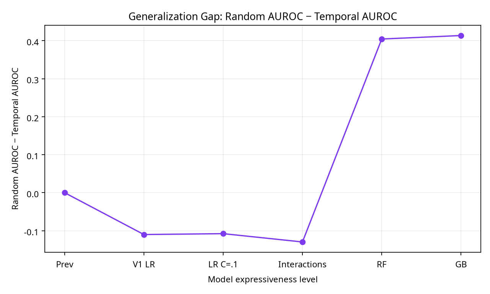

# PHASE 3.6.2 — MATCHED-FEATURE COMPLEXITY & INDUCTIVE-BIAS STUDY

## 1. Executive Summary

Phase 3.6.2 removed the identity ambiguity found in Phase 3.6.1. Every ladder level used the official restored Alibaba GPU2020 data, the registered random-stratified and temporal-future rows, the exact 14 numeric V1 features, the same feature order, train-only median imputation and standardization, validation-only isotonic calibration, and common metric definitions. The frozen V1 control reproduced its canonical AUROC values of 0.7201 random and 0.8302 temporal.

## 2. Motivation

The purpose was not to find a better model. It was to determine whether the temporal behavior observed in earlier research survives when non-model dimensions are held constant. The experiment therefore tested model expressiveness and inductive bias, not feature engineering, calibration optimization, uncertainty, abstention, or V1 integration.

## 3. Phase 3.6.1 Reconciliation Context

Phase 3.6.1 established that the earlier Phase 3.6 ladder was valid but non-equivalent to canonical V1 because it added one-hot `dominant_gpu_type`, used a different probability path, and used different Gradient Boosting hyperparameters. Phase 3.6.2 uses the matched 14-feature contract to resolve that limitation.

## 4. Experimental Hypothesis

The preregistered hypothesis was that increasing flexibility might improve random interpolation while damaging temporal generalization. The study does not assume that this pattern must occur, and it does not claim causality beyond the declared data and split contract.

## 5. Matched Feature Contract

All models saw exactly these 14 ordered numeric features: `job_start_time`, `n_tasks`, `n_distinct_task_names`, `sum_inst_num`, `mean_plan_cpu`, `max_plan_cpu`, `mean_plan_mem`, `max_plan_mem`, `mean_plan_gpu`, `max_plan_gpu`, `n_distinct_gpu_types`, `n_instances`, `n_distinct_machines`, and `mean_instance_start_time`. No categorical, contextual, drift, uncertainty, or newly engineered features were used. The matrix and row identity hashes are recorded in `results.json` and `manifest.json`.

## 6. Matched Split Contract

The registered train, validation, random-stratified test, and temporal-future test memberships were reused unchanged for every model. No temporal test resampling, rebalancing, boundary selection, or post-hoc model choice was performed.

## 7. Preprocessing Contract

Every learned model used training-fitted median imputation and standardization. The V1 control used its preserved serialized model and validation-fitted calibrator. All research candidates used validation-only isotonic calibration for probability-quality metrics. No temporal test data was used for fitting or selection.

## 8. Model Complexity Ladder

| Level | Model | Expressiveness | Configuration |
|---:|---|---|---|
| 0 | Prevalence | None | Training-set prevalence constant |
| 1 | V1 Logistic | Low | Preserved canonical V1 artifact |
| 2 | Linear Variant | Low | Logistic regression, `C=0.1` |
| 3 | Limited Interactions | Moderate | Three predeclared pairwise products with logistic regression |
| 4 | Constrained Nonlinear | Moderate | 25-tree Random Forest, depth 2, minimum leaf 50 |
| 5 | Gradient Boosting | High | 100 trees, learning rate 0.05, depth 2, random state 42 |

## 9. Reproduction of Canonical V1

Level 1 reproduced random AUROC 0.7201 and temporal AUROC 0.8302. This met the required control gate before interpreting the ladder.

## 10. Reproduction of Phase 3.1 Gradient Boosting

The matched-feature Phase 3.1 Gradient Boosting reproduction was random AUROC 0.7472 and temporal AUROC 0.3336, matching the historical candidate. The Phase 3.6-D configuration is not used here.

## 11. Complexity vs Random Generalization

Random AUROC increased from 0.5000 for prevalence to 0.7201 for V1, 0.7213 for the controlled linear variant, 0.7143 for limited interactions, 0.7249 for constrained Random Forest, and 0.7472 for Gradient Boosting. The highest random performance came from Gradient Boosting, but this was not treated as a promotion criterion.

## 12. Complexity vs Temporal Generalization

Temporal AUROC was 0.5000 for prevalence, 0.8302 for V1, 0.8290 for the controlled linear variant, 0.8439 for limited interactions, 0.3204 for constrained Random Forest, and 0.3336 for Gradient Boosting. The nonlinear models collapsed temporally, while the limited-interaction model improved the temporal score in this registered evaluation.

## 13. Generalization Gap

The signed gap is defined as **random AUROC minus temporal AUROC**. The gaps were 0.0000 for prevalence, -0.1101 for V1, -0.1077 for the linear variant, -0.1296 for limited interactions, 0.4044 for constrained Random Forest, and 0.4136 for Gradient Boosting. The large positive gaps for the two nonlinear tree models show substantial temporal degradation relative to interpolation.

## 14. Per-Model Results

| Model | Features | Random AUROC | Temporal AUROC | Random AUPRC | Temporal AUPRC | Temporal−Random AUROC | Interpretation |
|---|---:|---:|---:|---:|---:|---:|---|
| Prevalence | 14 | 0.5000 | 0.5000 | 0.2588 | 0.4342 | 0.0000 | Non-learning reference |
| V1 Logistic | 14 | 0.7201 | 0.8302 | 0.5397 | 0.7464 | +0.1101 | Strong temporal control |
| Linear Variant | 14 | 0.7213 | 0.8290 | 0.5359 | 0.7441 | +0.1077 | Essentially similar to V1 |
| Limited Interactions | 14 base + 3 predeclared products | 0.7143 | 0.8439 | 0.5466 | 0.7865 | +0.1296 | Temporal improvement; not monotonic complexity evidence |
| Constrained Nonlinear | 14 | 0.7249 | 0.3204 | 0.5750 | 0.4083 | −0.4044 | Severe temporal collapse |
| Gradient Boosting | 14 | 0.7472 | 0.3336 | 0.6149 | 0.4154 | −0.4136 | Random gain with severe temporal collapse |

## 15. Robustness Analysis

The main robust pattern is not a monotonic ranking by complexity. Both constrained tree models achieved modestly higher random AUROC than V1 but failed sharply on the temporal population. The linear variant remained close to V1 on both populations. Conversely, the small predeclared interaction model improved temporal AUROC and AUPRC in this single registered evaluation. Brier and ECE are reported under a common validation-only calibration contract, but the primary mechanistic evidence remains the ranking metrics.

## 16. Inductive-Bias Interpretation

**DOES COMPLEXITY HURT TEMPORAL GENERALIZATION? YES — PARTIAL EVIDENCE.** The answer is partial because the constrained Random Forest and Gradient Boosting results show the predicted interpolation-versus-temporal tradeoff, but the limited-interaction level does not: it improves temporal performance despite not being the least expressive level. Therefore the relationship is not monotonic and cannot be summarized as “more complexity always hurts.”

**DOES CONSTRAINED LINEAR STRUCTURE EXPLAIN PART OF V1 ROBUSTNESS? PARTIALLY SUPPORTED.** The linear models are stable across the two populations, and the two tree-based nonlinear models collapse temporally under the same feature/split/preprocessing controls. However, the interaction result demonstrates that some narrowly constrained nonlinearity can remain temporally stable or even improve the registered temporal score. This supports constrained linear structure as a plausible contributor, not a unique or causal explanation.

## 17. Limitations

The study uses one official dataset and one registered random/temporal evaluation pair. The small interaction set was predeclared but remains a specific representation choice. No confidence intervals were added merely for appearance. The result does not establish performance beyond the declared Alibaba trace, and the exact seven historical skipped test-node identities remain unrecoverable from preserved evidence.

## 18. Comparison Against Phase 3.6-D

| Dimension | Phase 3.6-D | Phase 3.6.2 |
|---|---|---|
| Feature space | Phase 3.6 LR added one-hot `dominant_gpu_type`; GB used numeric features | All models use exactly 14 numeric V1 features |
| Splits | Registered random/temporal rows | Same registered rows for every ladder level |
| Preprocessing | Mixed copy protocols | Common train-only imputation and standardization |
| Model configuration | Included Phase 3.6-D GB depth 3, learning rate 0.10 | Uses Phase 3.1 GB depth 2, learning rate 0.05 |
| Calibration | Raw copy metrics in parts of the ladder | Common validation-only isotonic calibration for learned candidates |
| Metrics | Historical copy metric paths | Common declared metric implementation |
| Protocol equivalence | Valid but non-equivalent research copy | Matched-feature controlled comparison |
| Scientific strength | Bounded forensic evidence | Stronger inductive-bias evidence, still dataset-bounded |

## 19. Final Scientific Conclusion

The matched experiment strengthens the claim that model inductive bias contributes to the temporal behavior observed in V1: the two flexible tree-based models gained random performance and then collapsed temporally under matched non-model conditions. Nevertheless, the limited-interaction result means the pattern is not monotonic. The correct conclusion is **partial evidence**, not proof that all added expressiveness is harmful and not proof of causality.

## 20. Implications for V1

V1 remains frozen, unchanged, and production-eligible. No alternative is integrated, even where a candidate exceeds V1 on one metric. The evidence supports preserving V1’s constrained architecture while treating narrowly controlled interaction models as research hypotheses rather than deployment candidates.

## 21. Next Research Question

A subsequent study should test the same predeclared ladder across additional forward temporal folds with uncertainty intervals and a fixed safety/coverage policy, without retuning on any future test. That would distinguish a repeatable inductive-bias effect from a single-dataset interaction.

## Final Status

**V1 status: FROZEN.** There is **no V1.1 integration, replacement, modification, threshold change, or calibration change**. Phase 3.6.2 ends with a scientific conclusion only.
