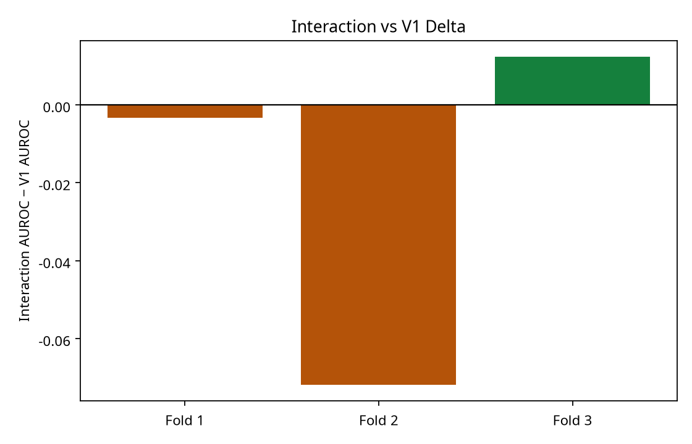
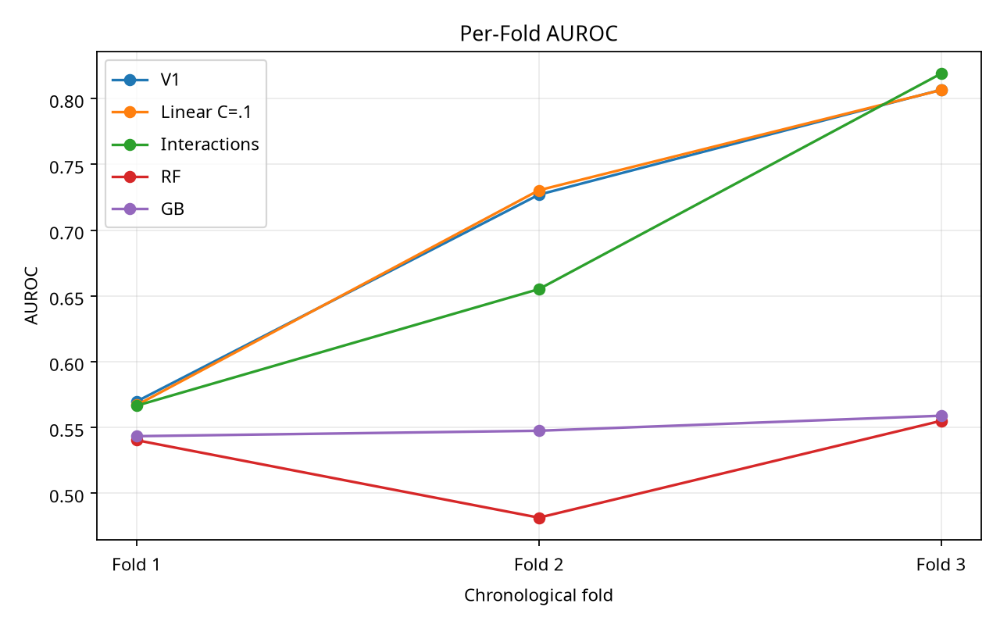
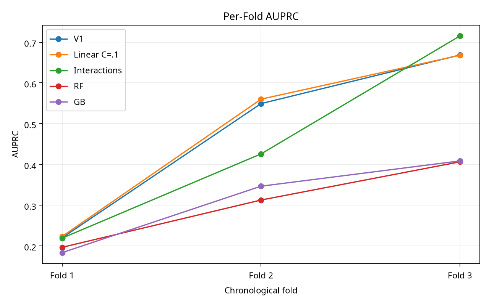
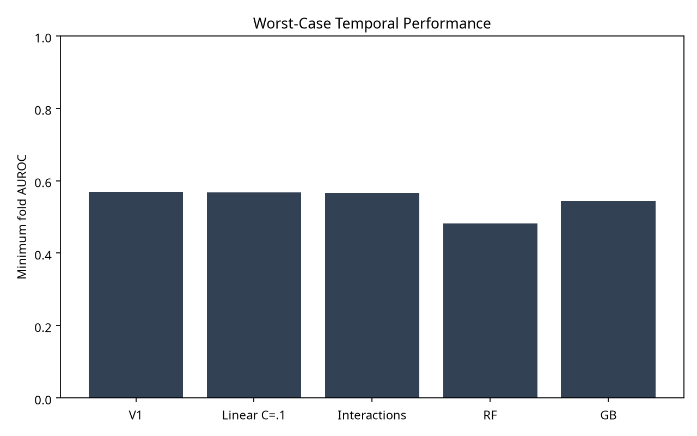
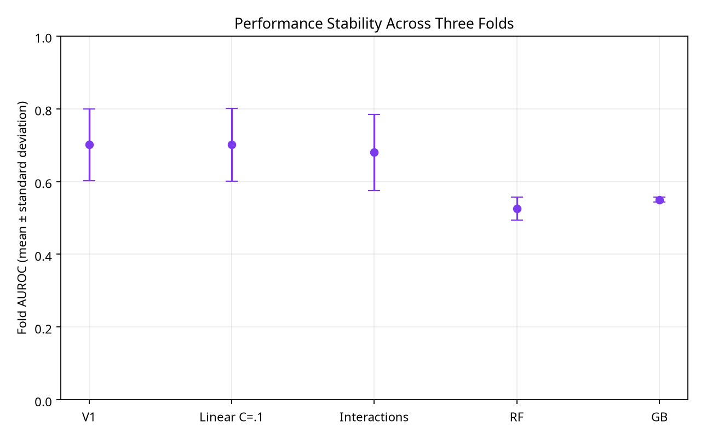

# PHASE 3.6.3 — MULTI-TEMPORAL INDUCTIVE-BIAS VALIDATION

## 1. Executive Summary

This validation study evaluated the frozen Phase 3.6.2 model ladder across the three authoritative Phase 3.5 chronological future folds. The exact 14-feature base contract, predeclared interactions, model definitions, train-only preprocessing, validation-only calibration, and fold boundaries were preserved. No model, fold, threshold, or acceptance criterion was selected after observing future-fold results.

## 2. Research Question and Hypothesis

The primary question was whether the three-interaction model that reached 0.8439 AUROC on the canonical temporal test would continue to outperform frozen V1 across multiple independent chronological future regimes. The preregistered hypothesis was deliberately non-directional: the interaction model could win, lose, or show regime sensitivity.

## 3. Fold Contract

The existing Phase 3.5 folds were reused without redesign: expanding historical training populations, immediately preceding validation populations, and contiguous future evaluation populations. Fold 1, Fold 2, and Fold 3 contain 2,000 future evaluation rows each. Their definitions, row hashes, temporal bounds, and no-overlap checks are recorded under `fold_definitions/` and `results.json`.

## 4. Matched Feature and Model Contract

All models used the exact 14 numeric V1 features, in canonical order, with training-fitted median imputation and standardization. Model definitions were frozen from Phase 3.6.2. The only derived representation was the unchanged three-interaction candidate: `n_tasks × mean_plan_cpu`, `n_tasks × mean_plan_gpu`, and `mean_plan_cpu × mean_plan_gpu`. No categorical, drift, contextual, uncertainty, or additional interaction feature was used.

## 5. Calibration and Metrics

Each fold/model fit isotonic calibration on that fold's historical validation population only. AUROC and AUPRC are the primary metrics; Brier and ECE are secondary and use the common declared calibration path. Future-fold predictions were never used for calibration or selection.

## 6. Required Per-Fold Results

| Fold | Model | AUROC | AUPRC | Brier | ECE |
|---|---|---:|---:|---:|---:|
| Fold 1 | V1 | 0.5698 | 0.2201 | 0.1905 | 0.2103 || Fold 1 | Linear C=.1 | 0.5670 | 0.2234 | 0.1894 | 0.2074 || Fold 1 | Interactions | 0.5666 | 0.2191 | 0.1871 | 0.2058 || Fold 1 | RF | 0.5403 | 0.1966 | 0.1764 | 0.1218 || Fold 1 | GB | 0.5434 | 0.1835 | 0.1547 | 0.0670 || Fold 2 | V1 | 0.7269 | 0.5493 | 0.2077 | 0.1094 || Fold 2 | Linear C=.1 | 0.7303 | 0.5601 | 0.2044 | 0.1052 || Fold 2 | Interactions | 0.6551 | 0.4258 | 0.2244 | 0.1179 || Fold 2 | RF | 0.4814 | 0.3126 | 0.2357 | 0.1403 || Fold 2 | GB | 0.5475 | 0.3465 | 0.2291 | 0.1337 || Fold 3 | V1 | 0.8066 | 0.6685 | 0.1491 | 0.0131 || Fold 3 | Linear C=.1 | 0.8064 | 0.6678 | 0.1494 | 0.0155 || Fold 3 | Interactions | 0.8189 | 0.7153 | 0.1371 | 0.0255 || Fold 3 | RF | 0.5550 | 0.4063 | 0.2311 | 0.0568 || Fold 3 | GB | 0.5589 | 0.4086 | 0.2309 | 0.0574 |

## 7. Model Summary

| Model | Mean AUROC | Median AUROC | Mean AUPRC | Median AUPRC | Folds beating V1 | Folds losing to V1 |
|---|---:|---:|---:|---:|---:|---:|
| V1 | 0.7011 | 0.7269 | 0.4793 | 0.5493 | — | — || Linear C=.1 | 0.7012 | 0.7303 | 0.4838 | 0.5601 | 1 | 2 || Interactions | 0.6802 | 0.6551 | 0.4534 | 0.4258 | 1 | 2 || RF | 0.5256 | 0.5403 | 0.3052 | 0.3126 | 0 | 3 || GB | 0.5499 | 0.5475 | 0.3129 | 0.3465 | 0 | 3 |

The model summaries also record minimum, maximum, standard deviation, and range. The worst future regime is retained rather than averaged away.

## 8. Interaction Primary Test

Interaction-minus-V1 AUROC deltas were: Fold 1 **-0.0032**, Fold 2 **-0.0718**, and Fold 3 **0.0123**. The interaction model beat V1 on **1/3 folds**, lost on **2/3 folds**, had mean delta **-0.0209**, median delta **-0.0032**, worst delta **-0.0718**, and best delta **0.0123**.

## 9. Temporal Robustness and Failure Consistency

V1 mean AUROC was **0.7011**, with worst fold **0.5698**. The interaction model mean was **0.6802**, with worst fold **0.5666**. RF and GB were lower and comparatively unstable or weak across the folds. The interaction model is **regime-sensitive**: it was close to V1 on Fold 1, materially worse on Fold 2, and better on Fold 3. RF is consistently low in this replay; GB is comparatively stable around a low AUROC, but neither is a reliable competitor to V1.

## 10. Generalization Analysis

The preserved canonical random-stratified evaluation is not a fold-specific random reference for these forward folds. Therefore no fabricated fold-level random-minus-future comparison is reported. The scientific comparison here is strictly across the authoritative future regimes.

## 11. Decision

**Outcome D — Interaction Instability / Partial Validation.** The Phase 3.6.2 interaction advantage did not persist consistently: it won one of three folds and lost two, including a −0.0718 AUROC loss on Fold 2. The result is therefore **promising but uncertain at most, and practically dataset/regime-sensitive**, not a strong candidate for integration. No unfavorable fold was removed.

## 12. Tree and Linear Interpretation

The RF and GB results provide additional support for the earlier observation that flexible tree models can fail under changing future distributions, although the three-fold evidence is descriptive and dataset-bounded. The C=0.1 linear model remains close to V1, supporting a broader constrained-linear stability hypothesis without proving that V1's exact parameterization is optimal.

## 13. Limitations

Only three chronological folds are available. This is insufficient for universal superiority claims or causal identification. The data is one restored Alibaba GPU2020 dataset, and fold-level estimates can vary with regime composition. The exact seven historical skipped test-node identities remain unrecoverable from preserved evidence.

## 14. V1 and Integration Status

V1 remains **FROZEN**. There is **no V1.1 integration, replacement, modification, threshold change, calibration change, runtime change, or safety-policy change**. This phase is validation evidence only.

## 15. Final Questions

**Does complexity hurt temporal generalization? YES — PARTIAL EVIDENCE.** The tree-based flexible models show the expected failure pattern, but the limited-interaction model is not uniformly worse and the relationship is not monotonic.

**Does the interaction model consistently outperform V1 across multiple future folds? NO.** It beats V1 on one fold and loses on two.

**Does constrained linear structure explain part of V1's temporal robustness? PARTIALLY SUPPORTED.** V1 and the nearby linear variant are comparatively stable, while the tree models are weak; however, the interaction model's mixed results prevent a stronger claim.

## 16. Next Research Question

A future study should predeclare additional forward folds or a second compatible dataset and evaluate the same frozen ladder with descriptive uncertainty intervals. Any candidate interaction model would require a new phase with broader safety, calibration, coverage, and operational analysis; it must not be integrated from this study.
